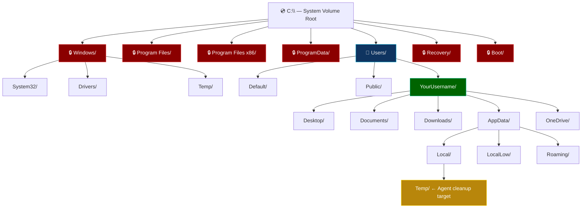
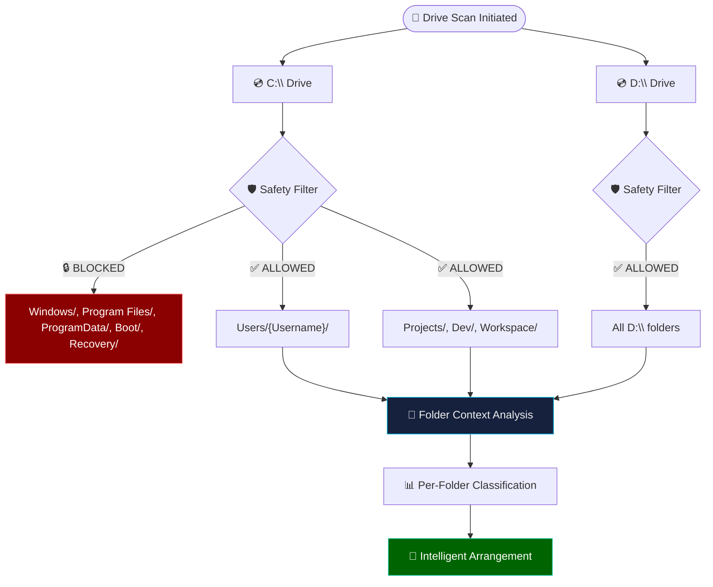
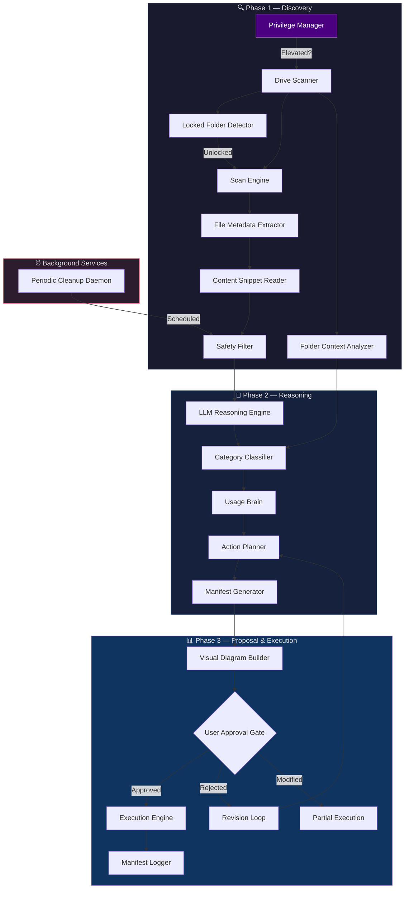
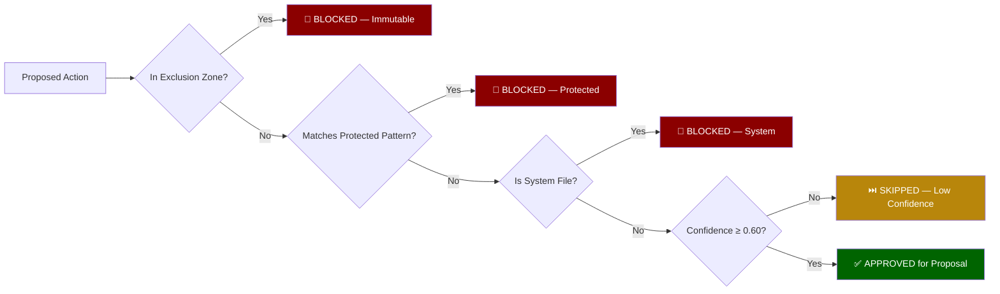
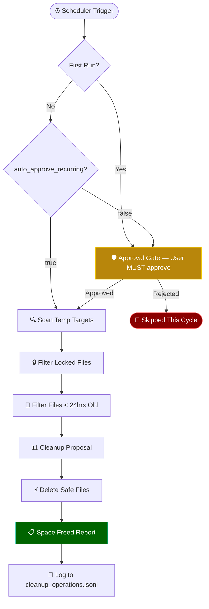
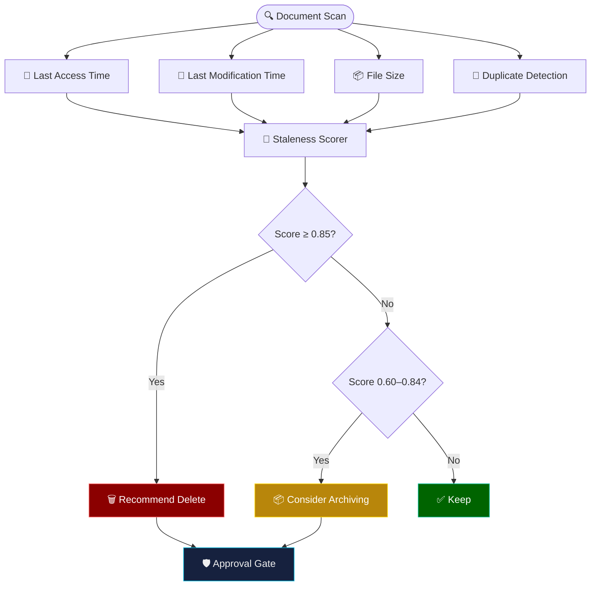
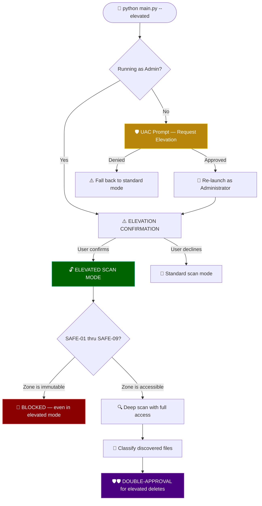
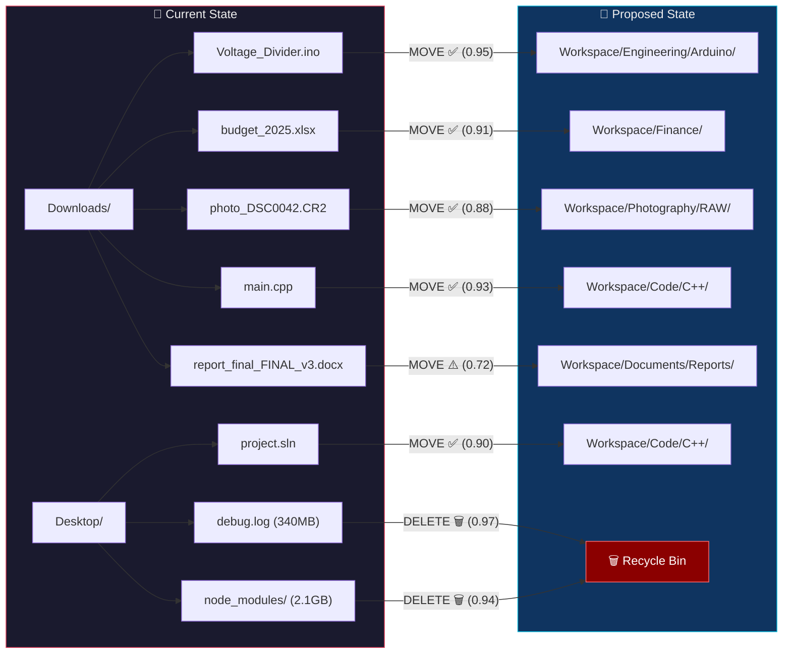
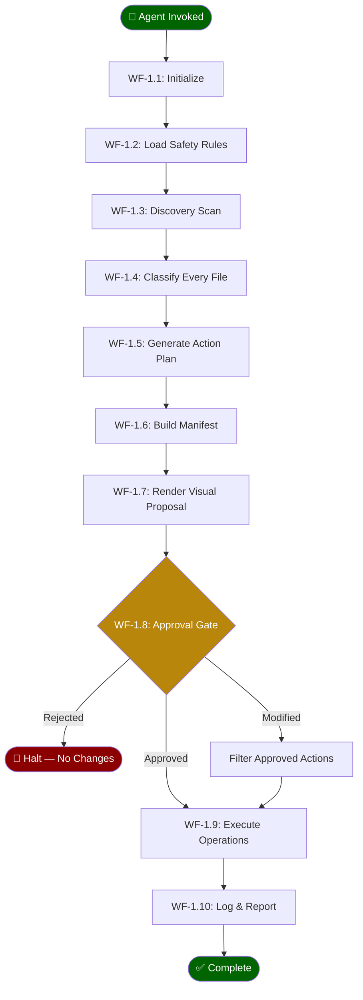

<p align="center">
  <strong>⚙️ AGENTIC FILE ARCHITECT v3.0</strong><br>
  <em>Intelligent, LLM-Powered File Organization & System Optimization for Windows</em>
</p>

---

<p align="center">
  <code>Scan Drives → Analyze Usage → Clean & Organize → Optimize</code><br>
  <sub>Your files. Your rules. Zero surprises. Maximum performance.</sub>
</p>

---

# 📋 Table of Contents

1. [Overview](#overview)
2. [Windows NTFS File Hierarchy — The Foundation](#windows-ntfs-file-hierarchy--the-foundation)
3. [System Speed-Up — What to Delete (and Why)](#system-speed-up--what-to-delete-and-why)
4. [Full Drive Intelligence](#full-drive-intelligence)
5. [Core Philosophy](#core-philosophy)
6. [System Architecture](#system-architecture)
7. [The Three-Phase Workflow](#the-three-phase-workflow)
8. [Reasoning Engine](#reasoning-engine)
9. [Safety Protocol](#safety-protocol)
10. [Clean-Up Intelligence](#clean-up-intelligence)
11. [Periodic Cleanup Daemon](#periodic-cleanup-daemon)
12. [Smart Usage Brain](#smart-usage-brain)
13. [Elevated Access Mode](#elevated-access-mode)
14. [Visual Proposal System](#visual-proposal-system)
15. [Python Architecture](#python-architecture)
16. [Configuration](#configuration)
17. [Sample Visual Output](#sample-visual-output)
18. [Quickstart](#quickstart)
19. [**Agent Workflows & Rules — The Complete Rulebook**](#agent-workflows--rules--the-complete-rulebook)
20. [FAQ](#faq)

---

# Overview

**Agentic File Architect** is a Python-based autonomous file organization and system optimization agent built for the Windows operating system. Unlike traditional file sorters that rely on brittle extension-matching rules, this agent uses a **Reasoning Engine** — powered by a local or cloud-based LLM — to classify files based on their *actual content*, filename semantics, and contextual metadata.

**In v3.0**, the agent expands from scanning specific folders to **intelligently scanning entire drives** (`C:\` and `D:\`), introduces a **Periodic Cleanup Daemon** that automatically clears system temp files, and deploys a **Smart Usage Brain** that identifies rarely-used documents for deletion — keeping your machine lean and fast.

### What Makes This Different

| Feature | Traditional Sorter | Agentic File Architect v3.0 |
|---|---|---|
| **Scan Scope** | User-selected folders | **Full drive scanning** (`C:\` + `D:\`) with smart exclusions |
| **Classification** | Extension-based (`.pdf → Documents`) | Content-aware reasoning via LLM |
| **User Control** | Post-hoc undo | **Pre-execution visual proposal** |
| **Cache Cleanup** | Manual selection | Auto-detected compiler/runtime artifacts |
| **Temp Cleanup** | Manual `%temp%` deletion | **Periodic automated cleanup** with scheduling |
| **Usage Analysis** | None | **Smart Usage Brain** — detects rarely-used documents |
| **Safety** | Whitelist/blacklist | Immutable exclusion zones + approval gate |
| **Transparency** | Log file | **Mermaid.js topology diagrams** |

> **Zero files are ever moved or deleted without explicit user approval.**

---

# Windows NTFS File Hierarchy — The Foundation

Before the agent touches a single byte, it must understand **where it's operating**. Windows uses the **NTFS (New Technology File System)** — a hierarchical, tree-structured file system that deliberately separates system operations, application data, and personal user content to ensure security and stability.

The Agentic File Architect is built on this foundational knowledge. Every scan path, safety exclusion, and workspace mapping is derived from the NTFS hierarchy.

## 1. The Global Root Structure (`C:\`)

At the highest level, the system drive (typically `C:`) contains specialized directories, each with a distinct purpose. **The agent treats these as a map of the entire operating environment.**



### Directory Purpose Matrix

| Directory | Role | Agent Behavior |
|---|---|---|
| `C:\Windows` | **Command Center.** Core OS files, kernel, `System32` (drivers, DLLs, system executables). | 🔒 **IMMUTABLE** — Never scanned, never touched. |
| `C:\Program Files` | 64-bit software installations. | 🔒 **IMMUTABLE** — Application binaries are managed by installers, not the agent. |
| `C:\Program Files (x86)` | 32-bit software on a 64-bit OS (WoW64 compatibility layer). | 🔒 **IMMUTABLE** — Same protection as `Program Files`. |
| `C:\ProgramData` | Hidden folder for machine-wide application settings and shared data. | 🔒 **IMMUTABLE** — Modifying this can break installed applications. |
| `C:\Users` | Repository for all individual **User Profiles**. | ✅ **SCAN TARGET** — The agent operates within user-space only. |
| `C:\Recovery` | System recovery partition data. | 🔒 **IMMUTABLE** — Critical for OS recovery. |
| `C:\Boot` | Boot configuration data (BCD). | 🔒 **IMMUTABLE** — Modifying this can prevent Windows from starting. |

> **Design Decision:** The agent only operates within `C:\Users\<Username>` and explicitly configured workspace paths. It treats the rest of the `C:\` root as a **read-only reference**, never a write target.

## 2. Professional User Profile Structure

Inside `C:\Users\[Username]`, Windows provides a standardized set of **"Library" folders** to categorize data types. Professionals use environment variables like `%USERPROFILE%` to navigate efficiently.

### Standard User Directories

| Folder | Environment Variable | Professional Usage | Agent Behavior |
|---|---|---|---|
| `Documents` | `%USERPROFILE%\Documents` | Primary storage for work-related files and project data. | ✅ Scan & classify |
| `Desktop` | `%USERPROFILE%\Desktop` | Temporary landing spot for active, daily-use files. | ✅ Scan & organize (high priority) |
| `Downloads` | `%USERPROFILE%\Downloads` | Staging area for incoming web resources. Should be cleared regularly. | ✅ Scan & organize (highest priority) |
| `Pictures` | `%USERPROFILE%\Pictures` | Image storage, including Screenshots subfolder. | ✅ Scan for media classification |
| `Videos` | `%USERPROFILE%\Videos` | Video file storage. | ✅ Scan for media classification |
| `Music` | `%USERPROFILE%\Music` | Audio file storage. | ⏭️ Skip by default (user preference) |
| `AppData` | `%APPDATA%` | **Hidden.** User-specific app settings. | ⚠️ Selective cleanup only (Temp subfolder) |

### The `AppData` Triad

The `AppData` directory is divided into three critical subfolders, each serving a distinct synchronization purpose:

| Subfolder | Path | Purpose | Agent Cleanup? |
|---|---|---|---|
| **Local** | `%LOCALAPPDATA%` | Machine-specific app data, caches, temp files. | ✅ `Temp/` subfolder only |
| **LocalLow** | `%USERPROFILE%\AppData\LocalLow` | Low-integrity app data (sandboxed browsers, Java). | ❌ Never |
| **Roaming** | `%APPDATA%` | User settings that sync across machines via domain login. | ❌ Never (would break roaming profiles) |

## 3. Key Concepts the Agent Leverages

### Permissions & Access Control Lists (ACLs)

Windows uses **ACLs** to restrict who can read, write, or execute files within each directory. The agent:
- Runs with **user-level permissions** only (never requests elevation)
- Gracefully handles `PermissionError` by skipping protected directories
- Never attempts to modify file ACLs or ownership

### Absolute vs. Relative Paths

| Path Type | Example | Agent Usage |
|---|---|---|
| **Absolute** | `C:\Users\Admin\Documents\report.pdf` | Used in all manifest entries and log files for precision |
| **Relative** | `..\Images\photo.jpg` | Never used — ambiguity is the enemy of safe file operations |
| **Environment Variable** | `%USERPROFILE%\Downloads` | Resolved at startup to support any username automatically |

### Volume vs. Directory

- A **Volume** is the entire logical partition (e.g., the `C:` drive, a `D:` data partition)
- A **Directory** is a container within that volume
- The agent can scan across multiple volumes if configured in `config.yaml`

## 4. Organization Best Practices (Built Into the Agent)

These professional standards are encoded directly into the agent's behavior:

| Best Practice | Implementation |
|---|---|
| **Depth Limit** | Aim for ≤ 4 levels deep (3 clicks to target). The agent's default `max_depth: 3` enforces this to avoid path-length errors (`MAX_PATH = 260` characters on legacy Windows). |
| **Generic → Specific** | Workspace structure flows from broad categories (e.g., `Code/`) to specific items (e.g., `Code/Python/ml_project/`). |
| **Cloud Integration** | Detects OneDrive-synced folders (`C:\Users\[User]\OneDrive`) and respects sync boundaries — never moves files *out* of a synced folder without explicit approval. |
| **Naming Convention** | Proposes consistent naming: lowercase, underscores, no spaces (e.g., `voltage_divider.ino` instead of `Voltage Divider (final).ino`). |
| **Date Prefixing** | For project folders, optionally suggests date prefixes (e.g., `2024_Q1_report/`) based on file creation date. |

---

# System Speed-Up — What to Delete (and Why)

Deleting personal documents rarely speeds up a PC. But clearing **system-generated junk** frees storage and reduces strain on Windows' virtual memory manager and file indexer. The Agentic File Architect targets these categories automatically.

## Cleanup Priority Matrix

| Priority | Category | Typical Space Saved | Risk Level | Agent Auto-Detect? |
|---|---|---|---|---|
| 🔴 **Critical** | Windows Update Cleanup | 1 – 20 GB | ✅ Safe | ✅ Yes |
| 🔴 **Critical** | User & System Temp Folders | 500 MB – 5 GB | ✅ Safe | ✅ Yes |
| 🟠 **High** | Browser Cache | 500 MB – 3 GB | ✅ Safe | ✅ Yes |
| 🟠 **High** | Compiler Artifacts (C++/Rust) | 1 – 20 GB | ✅ Safe (regenerable) | ✅ Yes |
| 🟡 **Medium** | Orphaned `node_modules/` | 1 – 10 GB | ✅ Safe (reinstallable) | ✅ Yes |
| 🟡 **Medium** | Forgotten `.exe` Installers | 200 MB – 5 GB | ⚠️ Verify first | ✅ Yes |
| 🟢 **Low** | Prefetch Cache | 50 – 200 MB | ⚠️ May briefly slow first app launch | ⚙️ Optional |
| 🟢 **Low** | DirectX Shader Cache | 100 – 500 MB | ✅ Safe (auto-regenerates) | ✅ Yes |

## 1. Essential System Cleanup

The safest and most impactful cleanup uses the built-in **Windows Disk Cleanup Tool** (`cleanmgr.exe`). The agent's cleanup module targets the same categories programmatically:

### Windows Update Cleanup

After major updates, Windows retains the **previous version** for rollback. Once you're confident the update is stable, these files are pure waste.

```
📁 C:\Windows\SoftwareDistribution\Download\    ← Downloaded update packages
📁 C:\Windows.old\                                ← Previous Windows installation

💡 Typical savings: 5 – 20 GB after a feature update
```

### Temporary Internet Files

Cached website data (HTML, CSS, JS, images) that browsers store for faster reloading. Over time, this cache becomes bloated with data from sites you'll never revisit.

```
📁 %LOCALAPPDATA%\Microsoft\Windows\INetCache\   ← IE/Edge legacy cache
📁 %LOCALAPPDATA%\Google\Chrome\User Data\Default\Cache\
📁 %LOCALAPPDATA%\Mozilla\Firefox\Profiles\*.default\cache2\

💡 Typical savings: 500 MB – 3 GB
```

### DirectX Shader Cache

Compiled GPU shaders cached to speed up graphics-heavy applications. Deleting forces the system to regenerate fresh, uncorrupted shader files.

```
📁 %LOCALAPPDATA%\D3DSCache\                      ← DirectX shader cache
📁 %LOCALAPPDATA%\NVIDIA\DXCache\                  ← NVIDIA-specific cache
📁 %LOCALAPPDATA%\AMD\DxCache\                     ← AMD-specific cache

💡 Typical savings: 100 – 500 MB
```

### Delivery Optimization Files

Previously downloaded update data that Windows shares with other PCs on your network (peer-to-peer update distribution).

```
📁 %SYSTEMROOT%\ServiceProfiles\NetworkService\AppData\Local\Microsoft\Windows\DeliveryOptimization\

💡 Typical savings: 200 MB – 2 GB
```

### Recycle Bin

Files in the Recycle Bin still occupy physical disk space until the bin is **emptied**.

```
📁 C:\$Recycle.Bin\{User-SID}\                     ← Per-user recycle storage

💡 Warning: Agent only proposes emptying after showing contents
```

## 2. Manual Temp File Removal

Temporary files are created by applications for short-term tasks but frequently fail to self-delete. Professionals clear these regularly:

### Target Locations

| Location | Access Command | What It Contains |
|---|---|---|
| **User Temp Folder** | `Win+R` → `%temp%` | App-generated temp files, extraction remnants, update staging |
| **System Temp Folder** | `Win+R` → `temp` | System-level temporary files shared across all users |
| **Prefetch Folder** | `Win+R` → `prefetch` | App launch optimization data — helps apps load faster, but stale entries cause performance stutter |

```python
# Agent's temp cleanup implementation
TEMP_TARGETS = [
    Path(os.environ.get("TEMP", "")),           # User temp: %LOCALAPPDATA%\Temp
    Path(os.environ.get("SYSTEMROOT", "C:\\Windows")) / "Temp",  # System temp
    Path(os.environ.get("SYSTEMROOT", "C:\\Windows")) / "Prefetch",
]

TEMP_SAFE_EXTENSIONS = {
    '.tmp', '.temp', '.log', '.old', '.bak',
    '.chk', '.dmp', '.etl',  # Event trace logs
}
```

> **Safety Note:** The agent never deletes files that are **currently locked** by a running process. It uses `os.access()` and exception handling to skip in-use files gracefully.

## 3. Application & Resource Management

Deleting individual junk files has less impact than addressing the **programs that generate them**:

### Unused Software

Uninstalling apps via `Settings > Apps` stops background processes from consuming RAM and CPU. The agent detects:
- Programs with no recent execution (> 90 days unused)
- Startup entries that slow boot time
- Duplicate applications (e.g., two PDF readers)

### Large Downloads (The Forgotten Graveyard)

The `Downloads` folder commonly accumulates:

| File Type | Example | Why Delete? |
|---|---|---|
| `.exe` / `.msi` installers | `VSCodeSetup-1.85.exe` | Already installed — installer is redundant |
| `.iso` disc images | `Win11_23H2.iso` | One-time use — 5+ GB each |
| `.zip` / `.7z` archives | `project-backup.zip` | Already extracted — archive is redundant |
| Large media files | `tutorial_4K.mp4` | Already watched — 2+ GB each |

The agent identifies these by cross-referencing:
- Installed programs list (for `.exe`/`.msi` matches)
- Extracted folder existence (for archive redundancy)
- File age and last access time

### Browser Cache

Each browser maintains its own cache. Clearing **"Cached images and files"** in browser settings accelerates page loading by forcing fresh downloads of potentially corrupted or outdated assets.

```
📊 Typical browser cache sizes:
   Chrome:  500 MB – 2 GB
   Firefox: 300 MB – 1 GB
   Edge:    400 MB – 1.5 GB
```

## 4. Automated Maintenance — Storage Sense

For a **"set and forget"** approach, the agent recommends enabling **Storage Sense** in Windows Storage Settings:

```
Settings → System → Storage → Storage Sense → ON
```

### Storage Sense Configuration Matrix

| Setting | Recommended Value | Why |
|---|---|---|
| Run Storage Sense | Every week | Prevents junk accumulation |
| Delete temporary files | When not in use by apps | Safe, automatic cleanup |
| Recycle Bin | Delete files older than 30 days | Prevents forgotten file accumulation |
| Downloads folder | Delete files older than 60 days | Keeps staging area clean |
| OneDrive | Make files online-only after 30 days | Frees local storage |

> **How the Agent Complements Storage Sense:** Storage Sense handles basic system-level cleanup. The Agentic File Architect handles the intelligent work — classifying, organizing, and detecting **project-specific** artifacts (compiler caches, orphaned dependencies, stale build outputs) that Storage Sense doesn't touch.

## 5. The Agent's Integrated Cleanup Engine

All cleanup knowledge above is codified into the agent's `cleanup/` module:

```python
class SystemCleanupEngine:
    """Integrates Windows system cleanup with agentic intelligence."""

    CLEANUP_TARGETS = {
        "windows_temp": {
            "paths": ["%TEMP%", "%SYSTEMROOT%\\Temp"],
            "max_age_days": 7,
            "confidence": 0.95,
            "category": "System Temp Files",
        },
        "prefetch": {
            "paths": ["%SYSTEMROOT%\\Prefetch"],
            "max_age_days": 30,
            "confidence": 0.80,
            "category": "Prefetch Cache",
        },
        "shader_cache": {
            "paths": [
                "%LOCALAPPDATA%\\D3DSCache",
                "%LOCALAPPDATA%\\NVIDIA\\DXCache",
                "%LOCALAPPDATA%\\AMD\\DxCache",
            ],
            "max_age_days": 14,
            "confidence": 0.90,
            "category": "DirectX Shader Cache",
        },
        "browser_cache": {
            "paths": [
                "%LOCALAPPDATA%\\Google\\Chrome\\User Data\\Default\\Cache",
                "%LOCALAPPDATA%\\Microsoft\\Edge\\User Data\\Default\\Cache",
                "%APPDATA%\\Mozilla\\Firefox\\Profiles",
            ],
            "max_age_days": 0,  # All cache is safe to delete
            "confidence": 0.92,
            "category": "Browser Cache",
        },
        "orphaned_installers": {
            "paths": ["%USERPROFILE%\\Downloads"],
            "extensions": [".exe", ".msi", ".iso"],
            "max_age_days": 30,
            "confidence": 0.75,  # Lower — needs user verification
            "category": "Redundant Installers",
        },
    }

    def scan_system(self) -> list[CleanupTarget]:
        """Scan all system cleanup targets and return proposed deletions."""
        targets = []
        for name, config in self.CLEANUP_TARGETS.items():
            for path_template in config["paths"]:
                resolved = Path(os.path.expandvars(path_template))
                if resolved.exists():
                    targets.extend(
                        self._scan_directory(resolved, config)
                    )
        return targets
```

---

# Full Drive Intelligence

**v3.0** expands the agent from targeted folder scanning to **full drive intelligence** — recursively reading and analyzing every accessible folder across `C:\` and `D:\` drives. The agent treats each drive as a complete ecosystem, understanding folder purposes through **Folder Context Analysis (FCA)** before classifying and arranging files.

> **Design Principle:** Scan everything, touch only what's safe, propose everything, execute nothing without approval.

## Dual-Drive Scan Architecture



## Folder Context Analysis (FCA)

The agent doesn't just scan files — it **reads the purpose of every folder** by analyzing its contents holistically. This enables intelligent arrangement decisions.

### How FCA Works

```
For each folder encountered:
  ├── Read folder name tokens (semantic analysis)
  ├── Sample 5–10 files inside (content snippets + extensions)
  ├── Detect dominant file type (e.g., 80% .py files = Python project)
  ├── Check for project markers:
  │   ├── package.json → Node.js project
  │   ├── Cargo.toml → Rust project
  │   ├── .sln / .csproj → C#/.NET project
  │   ├── CMakeLists.txt / Makefile → C/C++ project
  │   ├── requirements.txt / pyproject.toml → Python project
  │   ├── .ino → Arduino project
  │   └── pom.xml / build.gradle → Java project
  ├── Compute folder purpose confidence score
  └── Assign folder category + recommended workspace location
```

### FCA Classification Matrix

| Folder Signal | Detected Category | Arrangement Action |
|---|---|---|
| Contains `.sln` + `.cs` files | `Project/CSharp` | Keep in place — flag as active project |
| Contains `package.json` + `node_modules/` | `Project/NodeJS` | Keep in place — flag as active project |
| Contains only `.jpg`/`.png`/`.cr2` files | `Media/Photography` | Propose move to `Media/Photography/` |
| Contains mixed `.pdf`/`.docx` files | `Documents/Mixed` | Propose move to `Documents/` |
| Contains only `.tmp`/`.log`/`.bak` files | `Cache/Disposable` | Propose cleanup via Approval Gate |
| Contains `model.h5`/`.onnx`/`.pt` files | `Data/ML_Models` | Propose move to `Data/ML/` |
| Empty folder with no files | `Empty/Stale` | Propose deletion via Approval Gate |

## Smart Depth Adaptation

The agent adjusts its scan depth based on folder type — scanning deeper into user-created folders while staying shallow in application-level directories.

| Zone | Default Depth | Rationale |
|---|---|---|
| `C:\Users\{User}\Documents\` | **5 levels** | User content is deeply nested in project folders |
| `C:\Users\{User}\Desktop\` | **2 levels** | Desktop is a flat staging area |
| `C:\Users\{User}\Downloads\` | **2 levels** | Downloads is a flat inbox |
| `C:\Users\{User}\AppData\Local\` | **1 level** | Only scan for cleanup targets (Temp folder) |
| `D:\` (data drive) | **4 levels** | User-organized data, moderately deep |
| `C:\` root-level folders (non-excluded) | **3 levels** | Custom folders like `C:\Projects` |

## Drive-Specific Configuration

```python
class DriveScanner:
    """Full-drive intelligence scanner with Folder Context Analysis."""

    DRIVE_TARGETS = {
        "C:\\": {
            "entry_points": [
                Path.home(),                          # C:\Users\{user}
                Path.home().parent,                    # C:\Users\ (for shared folders)
            ],
            "user_custom_roots": [],                   # Auto-detected C:\ root folders
            "max_depth_user": 5,
            "max_depth_system": 1,
        },
        "D:\\": {
            "entry_points": [Path("D:\\")],
            "max_depth_user": 4,
            "max_depth_system": 3,
        },
    }

    def discover_entry_points(self, drive: str) -> list[Path]:
        """Auto-discover scannable root folders on a drive."""
        drive_root = Path(drive)
        entry_points = []

        for item in drive_root.iterdir():
            if item.is_dir() and self.safety_guard.is_safe(item):
                entry_points.append(item)

        return entry_points

    def analyze_folder_context(self, folder: Path) -> FolderContext:
        """Perform Folder Context Analysis on a directory."""
        project_markers = {
            "package.json": "Project/NodeJS",
            "Cargo.toml": "Project/Rust",
            "CMakeLists.txt": "Project/C++",
            "requirements.txt": "Project/Python",
            "pyproject.toml": "Project/Python",
            ".sln": "Project/CSharp",
            "pom.xml": "Project/Java",
            "build.gradle": "Project/Java",
        }

        # Check for project markers
        for marker, category in project_markers.items():
            marker_files = list(folder.glob(marker))
            if marker_files:
                return FolderContext(
                    path=folder,
                    category=category,
                    confidence=0.92,
                    reasoning=f"Contains {marker} — identified as {category}",
                    action="KEEP_IN_PLACE",
                )

        # Analyze dominant file types
        file_types = self._sample_file_types(folder, sample_size=10)
        dominant = max(file_types, key=file_types.get) if file_types else "Unknown"

        return FolderContext(
            path=folder,
            category=dominant,
            confidence=file_types.get(dominant, 0.0),
            reasoning=f"Dominant file type: {dominant}",
            action="PROPOSE_MOVE" if file_types.get(dominant, 0) >= 0.60 else "SKIP",
        )
```

---

# Core Philosophy

```
┌─────────────────────────────────────────────────────┐
│                                                     │
│   "The agent works FOR you, not ON your behalf."    │
│                                                     │
│   Every action is proposed, visualized,             │
│   and gated behind your approval.                   │
│                                                     │
└─────────────────────────────────────────────────────┘
```

### Design Principles

1. **Zero-Hardcoding** — No file is categorized by extension alone. The Reasoning Engine infers category from filename patterns, content snippets, and directory context.
2. **Full Transparency** — Every proposed action is rendered as a visual diagram *before* execution.
3. **Immutable Safety Zones** — Critical system directories are permanently excluded and cannot be overridden, even by the user.
4. **Reversible Operations** — A manifest log captures every operation, enabling full rollback.
5. **Progressive Trust** — The agent learns from your approval/rejection patterns to improve future proposals.

---

# System Architecture



### Component Breakdown

| Component | Responsibility |
|---|---|
| **Drive Scanner** | Discovers entry points across `C:\` and `D:\` drives, applies safety exclusions at drive root level |
| **Scan Engine** | Recursively walks target directories, respecting smart depth limits per folder type |
| **Folder Context Analyzer** | Reads folder contents to determine purpose (project type, media collection, etc.) |
| **Metadata Extractor** | Reads file size, timestamps, MIME type, encoding |
| **Content Snippet Reader** | Reads first 512 bytes of text files for classification |
| **Safety Filter** | Enforces immutable exclusion zones before any processing |
| **LLM Reasoning Engine** | Classifies files via prompt-based reasoning |
| **Usage Brain** | Scores documents for staleness using access patterns, modification history, size, and duplicates |
| **Category Classifier** | Combines FCA and LLM reasoning to assign final category |
| **Action Planner** | Determines `MOVE`, `DELETE`, `ARCHIVE`, or `SKIP` for each file |
| **Manifest Generator** | Builds a JSON manifest of all proposed actions |
| **Visual Diagram Builder** | Renders Mermaid.js / tree-view proposals |
| **Approval Gate** | Blocks execution until user confirms |
| **Execution Engine** | Performs `shutil.move()` and `os.remove()` operations |
| **Manifest Logger** | Logs every operation for audit and rollback |
| **Periodic Cleanup Daemon** | Scheduled background service for clearing Prefetch, User Temp, System Temp |
| **Privilege Manager** | Handles UAC elevation, admin detection, session timeout, and elevated audit logging |
| **Locked Folder Detector** | Identifies ACL-locked, EFS-encrypted, handle-locked, and hidden+system folders |

---

# The Three-Phase Workflow

## Phase 1 — Discovery (The Scan)

The agent scans user-specified directories (default: `C:\Users\<user>\Desktop`, `C:\Users\<user>\Downloads`, and any configured workspace paths).

**What It Captures:**

```
For each file:
  ├── Full path
  ├── File size (bytes)
  ├── Last modified timestamp
  ├── MIME type (via python-magic)
  ├── Content snippet (first 512 bytes, text files only)
  ├── Filename semantic tokens (split on _ - . CamelCase)
  └── Parent directory context
```

**Depth Control:**

| Scope | Default Depth | Configurable |
|---|---|---|
| `Desktop` | 2 levels | ✅ |
| `Downloads` | 1 level | ✅ |
| Custom paths | 3 levels | ✅ |

---

## Phase 2 — The Proposal (The Diagram)

The Reasoning Engine processes every discovered file and produces an **Action Manifest** — a structured list of proposed operations.

**Manifest Entry Example:**

```json
{
  "file": "C:\\Users\\Manish\\Downloads\\Voltage_Divider.ino",
  "size_mb": 0.003,
  "category": "Arduino/Embedded",
  "reasoning": "File extension .ino indicates Arduino sketch. Content contains #include <Arduino.h> and void setup() pattern.",
  "action": "MOVE",
  "destination": "C:\\Workspace\\Engineering\\Arduino\\Voltage_Divider.ino",
  "confidence": 0.95
}
```

**Confidence Thresholds:**

| Confidence | Behavior |
|---|---|
| `≥ 0.85` | Auto-proposed (still requires approval) |
| `0.60 – 0.84` | Proposed with `⚠️ LOW CONFIDENCE` flag |
| `< 0.60` | Skipped — flagged for manual review |

---

## Phase 3 — Approval Gate

**The agent never executes without your explicit confirmation.**

### Approval Modes

| Mode | Description |
|---|---|
| `Y` | Approve all proposed actions |
| `N` | Reject all — return to idle |
| `M` | Modify — opens interactive editor to accept/reject individual actions |
| `E` | Export manifest as JSON for external review |

```
╔══════════════════════════════════════════════════════════╗
║              ⚙️  APPROVAL GATE                          ║
╠══════════════════════════════════════════════════════════╣
║                                                          ║
║  Proposed Actions:  47 MOVE  |  23 DELETE  |  5 SKIP     ║
║  Estimated Space Freed:  1.2 GB                          ║
║                                                          ║
║  [Y] Approve All                                         ║
║  [N] Reject All                                          ║
║  [M] Modify Individual Actions                           ║
║  [E] Export Manifest                                     ║
║                                                          ║
╚══════════════════════════════════════════════════════════╝
```

---

# Reasoning Engine

The Reasoning Engine replaces hardcoded extension rules with **semantic classification**. It works in two modes:

### Mode A — LLM-Powered (Recommended)

Sends a structured prompt to a local or cloud LLM (OpenAI, Anthropic, Ollama, etc.):

```python
CLASSIFICATION_PROMPT = """
You are a file classification engine. Given the following file metadata,
determine its category and recommended workspace location.

Filename: {filename}
Extension: {extension}
MIME Type: {mime_type}
Content Snippet (first 512 bytes):
---
{content_snippet}
---
Parent Directory: {parent_dir}

Respond in JSON:
{{
  "category": "<one of: Code/Python, Code/C++, Code/Arduino, Code/Web,
                Document/PDF, Document/Spreadsheet, Media/Image,
                Media/Video, Media/Audio, Archive, Data/CSV, Data/JSON,
                Design/CAD, Design/3DPrint, Cache/Compiler, Cache/Runtime,
                Cache/System, Unknown>",
  "confidence": <0.0 to 1.0>,
  "reasoning": "<one-line explanation>",
  "suggested_path": "<recommended destination path>"
}}
"""
```

### Mode B — Local Heuristic Fallback

When no LLM is available, the agent falls back to a rule-based classifier using weighted signals:

```python
HEURISTIC_SIGNALS = {
    "filename_tokens":   0.30,   # Semantic meaning from filename
    "extension":         0.25,   # File extension mapping
    "mime_type":         0.20,   # Detected MIME type
    "content_patterns":  0.15,   # Regex patterns in content snippet
    "directory_context":  0.10,  # Parent folder name signals
}
```

**Example Heuristic Chain:**

```
File: "neural_net_trainer_v2.py"
  ├── Tokens: [neural, net, trainer, v2] → Code/ML (0.30 × 0.9 = 0.27)
  ├── Extension: .py → Code/Python (0.25 × 1.0 = 0.25)
  ├── MIME: text/x-python → Code/Python (0.20 × 1.0 = 0.20)
  ├── Content: "import torch" → Code/ML (0.15 × 0.95 = 0.14)
  └── Directory: "Downloads" → Neutral (0.10 × 0.1 = 0.01)
                                          ─────────────
                                    Total Score: 0.87 → Code/ML ✅
```

---

# Safety Protocol

### Immutable Exclusion Zones

These directories are **permanently protected**. The agent cannot move, delete, or modify any file within them — this is enforced at the code level, not via configuration.

```python
IMMUTABLE_EXCLUSIONS = frozenset([
    r"C:\Windows",
    r"C:\Windows\System32",
    r"C:\Windows\SysWOW64",
    r"C:\Program Files",
    r"C:\Program Files (x86)",
    r"C:\ProgramData",
    r"C:\$Recycle.Bin",
    r"C:\Recovery",
    r"C:\Boot",
])
```

### Protected Patterns

Files and directories matching these patterns are **never touched**:

```python
PROTECTED_PATTERNS = [
    r"\.git(/|\\)",          # Git repositories
    r"\.svn(/|\\)",          # SVN repositories
    r"\.hg(/|\\)",           # Mercurial repositories
    r"node_modules(/|\\)",   # Node.js dependencies
    r"\.venv(/|\\)",         # Python virtual environments
    r"\.env$",               # Environment variable files
    r"\.ssh(/|\\)",          # SSH keys
    r"\.gnupg(/|\\)",        # GPG keys
    r"id_rsa",               # SSH private keys
    r"\.pem$",               # Certificate files
    r"\.key$",               # Key files
]
```

### Safety Validation Pipeline



---

# Clean-Up Intelligence

The agent identifies and proposes deletion of **build artifacts, caches, and temporary files** that consume disk space without providing value.

### Detection Rules

| Category | Patterns Detected | Typical Space Saved |
|---|---|---|
| **C++ Compiler Artifacts** | `*.obj`, `*.o`, `*.pdb`, `*.ilk`, `*.exp`, `*.lib` (non-library), `Debug/`, `Release/`, `x64/` build folders | 500 MB – 5 GB |
| **Python Caches** | `__pycache__/`, `*.pyc`, `*.pyo`, `.pytest_cache/`, `*.egg-info/` | 50 – 500 MB |
| **Node.js Artifacts** | `node_modules/` (orphaned), `.next/`, `dist/` (stale), `.cache/` | 1 – 10 GB |
| **Rust Build Cache** | `target/debug/`, `target/release/` | 1 – 20 GB |
| **Windows Temp Files** | `%TEMP%\*`, `*.tmp`, `Thumbs.db`, `desktop.ini` (orphaned) | 100 MB – 2 GB |
| **IDE Caches** | `.vs/`, `.idea/`, `*.suo`, `*.user` | 50 – 500 MB |
| **Log Accumulation** | `*.log` files > 50 MB or > 30 days old | Variable |

### Smart Detection Example

```python
class CleanupDetector:
    """Identifies safe-to-delete artifacts using contextual analysis."""

    def analyze_cpp_project(self, project_root: Path) -> list[CleanupTarget]:
        targets = []

        # Detect build output directories
        for build_dir in ["Debug", "Release", "x64", "x86", "build", "out"]:
            candidate = project_root / build_dir
            if candidate.exists() and self._contains_only_artifacts(candidate):
                targets.append(CleanupTarget(
                    path=candidate,
                    category="C++ Build Artifacts",
                    size=self._dir_size(candidate),
                    confidence=0.92,
                    reasoning=f"Directory '{build_dir}' contains only "
                              f"compiler output (.obj, .exe, .pdb). "
                              f"Regenerable via build system."
                ))

        # Detect scattered .obj files
        for obj_file in project_root.rglob("*.obj"):
            if not self._is_3d_model(obj_file):  # Exclude Wavefront .obj
                targets.append(CleanupTarget(
                    path=obj_file,
                    category="C++ Object File",
                    size=obj_file.stat().st_size,
                    confidence=0.95,
                    reasoning="Compiler intermediate object file. "
                              "Regenerated on next build."
                ))

        return targets
```

> **Important:** The agent distinguishes between a Wavefront 3D `.obj` file (valuable) and a C++ compiler `.obj` file (cache) by reading the file header — never by extension alone.

---

# Periodic Cleanup Daemon

**v3.0** introduces a **scheduled cleanup engine** that periodically clears system-generated junk from three critical Windows temp locations — freeing disk space and reducing strain on the file indexer, virtual memory manager, and Prefetch subsystem.

## Target Locations

| Target | Path | What It Contains | Cleanup Frequency |
|---|---|---|---|
| 🔴 **User Temp** | `%USERPROFILE%\AppData\Local\Temp` | App-generated temp files, extraction remnants, update staging | **Daily** |
| 🔴 **System Temp** | `C:\Windows\Temp` | System-level temporary files shared across all users | **Daily** |
| 🟠 **Prefetch** | `C:\Windows\Prefetch` | App launch optimization data (`.pf` files). Stale entries cause performance stutter. | **Weekly** |

> **Why Prefetch?** Windows Prefetch monitors the first 10 seconds of every app launch and caches the data to speed up subsequent launches. Over time, stale entries for uninstalled or rarely-used apps accumulate, wasting disk I/O during boot. Clearing Prefetch forces Windows to rebuild a fresh, lean cache.

## Cleanup Safety Rules

```
⚠️  IMPORTANT — Even in periodic mode, these safety rules are absolute:

  1. NEVER delete files locked by running processes (PermissionError → skip)
  2. NEVER delete files modified in the last 24 hours (may be actively in use)
  3. ALWAYS require user approval on the FIRST run (cannot be bypassed)
  4. Subsequent runs MAY be auto-approved only if "auto_approve_recurring: true"
  5. ALWAYS log every deletion to logs/cleanup_operations.jsonl
  6. ALWAYS report total space freed after each cleanup cycle
```

## Daemon Architecture



## Implementation

```python
import os
import time
import sched
from pathlib import Path
from datetime import datetime, timedelta


class PeriodicCleanupDaemon:
    """Scheduled cleanup engine for Windows temp directories.

    Clears system-generated junk from Prefetch, User Temp, and System Temp
    on a configurable schedule with full safety enforcement.
    """

    CLEANUP_TARGETS = {
        "user_temp": {
            "path": Path(os.environ.get("TEMP", "")),
            "frequency_hours": 24,
            "min_age_hours": 24,
            "description": "User Temp Files",
        },
        "system_temp": {
            "path": Path(os.environ.get("SYSTEMROOT", "C:\\Windows")) / "Temp",
            "frequency_hours": 24,
            "min_age_hours": 24,
            "description": "System Temp Files",
        },
        "prefetch": {
            "path": Path(os.environ.get("SYSTEMROOT", "C:\\Windows")) / "Prefetch",
            "frequency_hours": 168,  # Weekly
            "min_age_hours": 168,    # Only delete .pf files > 7 days old
            "description": "Prefetch Cache",
        },
    }

    def __init__(self, config: dict):
        self.auto_approve = config.get("auto_approve_recurring", False)
        self.first_run_complete = False
        self.scheduler = sched.scheduler(time.time, time.sleep)
        self.log_path = Path("logs/cleanup_operations.jsonl")

    def run_cleanup_cycle(self) -> dict:
        """Execute one cleanup cycle across all targets."""
        results = {"freed_bytes": 0, "deleted": 0, "skipped": 0, "errors": 0}

        for name, target in self.CLEANUP_TARGETS.items():
            target_path = target["path"]
            if not target_path.exists():
                continue

            min_age = timedelta(hours=target["min_age_hours"])
            cutoff = datetime.now() - min_age

            try:
                for item in target_path.iterdir():
                    if item.is_file():
                        try:
                            stat = item.stat()
                            modified = datetime.fromtimestamp(stat.st_mtime)

                            # Skip recently modified files
                            if modified > cutoff:
                                results["skipped"] += 1
                                continue

                            # Attempt deletion
                            file_size = stat.st_size
                            item.unlink()
                            results["freed_bytes"] += file_size
                            results["deleted"] += 1

                        except PermissionError:
                            results["skipped"] += 1  # File is locked
                        except OSError:
                            results["errors"] += 1
            except PermissionError:
                pass  # Cannot access directory

        return results

    def format_report(self, results: dict) -> str:
        """Generate a human-readable cleanup report."""
        freed_mb = results["freed_bytes"] / (1024 * 1024)
        return (
            f"\n{'='*50}\n"
            f"  🧹 PERIODIC CLEANUP REPORT\n"
            f"{'='*50}\n"
            f"  ✅ Deleted:  {results['deleted']} files\n"
            f"  ⏭️  Skipped:  {results['skipped']} files (locked/recent)\n"
            f"  ❌ Errors:   {results['errors']} files\n"
            f"  💾 Freed:    {freed_mb:.1f} MB\n"
            f"{'='*50}\n"
        )
```

### Schedule Configuration

```yaml
# In config.yaml → periodic_cleanup section
periodic_cleanup:
  enabled: true
  auto_approve_recurring: false    # ⚠️ Set true only if you trust the agent fully
  schedule:
    user_temp:    "daily"          # Options: hourly, daily, weekly, monthly
    system_temp:  "daily"
    prefetch:     "weekly"
  min_file_age_hours: 24           # Never delete files newer than this
  log_path: "logs/cleanup_operations.jsonl"
```

---

# Smart Usage Brain

The **Usage Brain** is the agent's intelligence layer for identifying **rarely-used documents** that waste disk space. Unlike simple age-based filters, the Usage Brain scores every document using a **multi-signal staleness algorithm** that considers access patterns, modification history, file size, and duplicate detection.

> **Core Principle:** The Usage Brain only *recommends* — it **never auto-deletes**. All recommendations pass through the standard Approval Gate.

## How It Works



## Staleness Score Algorithm

Every document is scored on a **0.0 – 1.0 scale** using four weighted signals:

| Signal | Weight | How It's Measured | Score Logic |
|---|---|---|---|
| **Days Since Last Access** | `0.40` | `os.stat().st_atime` | 0 days = 0.0, 30 days = 0.3, 90 days = 0.7, 180+ days = 1.0 |
| **Days Since Last Modification** | `0.30` | `os.stat().st_mtime` | 0 days = 0.0, 30 days = 0.3, 90 days = 0.7, 180+ days = 1.0 |
| **File Size (Waste Factor)** | `0.15` | `os.stat().st_size` | < 1MB = 0.1, 1–50MB = 0.3, 50–500MB = 0.6, > 500MB = 1.0 |
| **Duplicate Score** | `0.15` | SHA-256 hash comparison | No duplicate = 0.0, Exact duplicate exists = 1.0 |

### Staleness Formula

```
staleness_score = (
    0.40 × normalize_access_days(days_since_access) +
    0.30 × normalize_modify_days(days_since_modify) +
    0.15 × normalize_size(file_size_bytes) +
    0.15 × duplicate_score
)
```

### Staleness Thresholds

| Score | Indicator | Action | Description |
|---|---|---|---|
| `≥ 0.85` | 🗑️ | **Recommend Delete** | File hasn't been accessed or modified in months, takes significant space |
| `0.60 – 0.84` | 📦 | **Consider Archiving** | File is aging — suggest moving to archive or cloud storage |
| `< 0.60` | ✅ | **Keep** | File is recent, small, or actively used — no action needed |

## Document Types Analyzed

The Usage Brain focuses on **user documents** — files that the user created or downloaded for personal use:

| Type | Extensions | Why Analyze? |
|---|---|---|
| **Office Documents** | `.docx`, `.xlsx`, `.pptx`, `.odt`, `.ods` | Often downloaded once, opened once, never again |
| **PDFs** | `.pdf` | Accumulate rapidly from web downloads |
| **Plain Text** | `.txt`, `.md`, `.rtf` | Small but numerous — clutter over time |
| **Data Files** | `.csv`, `.json`, `.xml` | One-time data dumps that outlive their usefulness |
| **Images** | `.jpg`, `.png`, `.gif`, `.bmp`, `.tiff` | Screenshots and downloads accumulate fast |
| **Videos** | `.mp4`, `.mkv`, `.avi`, `.mov` | Largest waste — a single 4K video can be 5+ GB |
| **Archives** | `.zip`, `.7z`, `.rar`, `.tar.gz` | Often already extracted — archive is redundant |
| **Installers** | `.exe`, `.msi`, `.iso` | Already installed — installer is redundant |

### Protected from Analysis (Never Scored)

These file types are **excluded** from staleness scoring because deleting them could break running systems:

- Source code files (`.py`, `.js`, `.cpp`, `.rs`, `.java`, etc.)
- Configuration files (`.yaml`, `.toml`, `.ini`, `.conf`)
- Version control (`.git/`, `.svn/`, `.hg/`)
- Cryptographic keys (`.pem`, `.key`, `.ssh/`, `.gnupg/`)
- Environment files (`.env`)
- Database files (`.db`, `.sqlite`, `.kdbx`)
- Active project files (folders containing project markers like `package.json`, `.sln`, etc.)

## Implementation

```python
import os
import hashlib
from pathlib import Path
from datetime import datetime, timedelta
from dataclasses import dataclass


@dataclass
class UsageReport:
    """Report for a single file's usage analysis."""
    path: Path
    staleness_score: float
    days_since_access: int
    days_since_modify: int
    size_bytes: int
    has_duplicate: bool
    recommendation: str      # "DELETE", "ARCHIVE", "KEEP"
    reasoning: str


class UsageBrain:
    """Intelligent document usage analyzer — identifies rarely-used files.

    Scores documents on a 0.0–1.0 staleness scale using access patterns,
    modification history, file size, and duplicate detection.
    """

    DOCUMENT_EXTENSIONS = {
        '.docx', '.xlsx', '.pptx', '.odt', '.ods', '.odp',
        '.pdf', '.txt', '.md', '.rtf', '.csv', '.json', '.xml',
        '.jpg', '.jpeg', '.png', '.gif', '.bmp', '.tiff', '.webp',
        '.mp4', '.mkv', '.avi', '.mov', '.wmv', '.flv',
        '.zip', '.7z', '.rar', '.tar', '.gz',
        '.exe', '.msi', '.iso',
    }

    PROTECTED_EXTENSIONS = {
        '.py', '.js', '.ts', '.cpp', '.c', '.h', '.hpp', '.rs',
        '.java', '.go', '.rb', '.php', '.swift', '.kt', '.ino',
        '.yaml', '.yml', '.toml', '.ini', '.conf', '.cfg',
        '.env', '.pem', '.key', '.kdbx', '.wallet',
        '.db', '.sqlite', '.sqlite3',
    }

    # Signal weights
    WEIGHT_ACCESS  = 0.40
    WEIGHT_MODIFY  = 0.30
    WEIGHT_SIZE    = 0.15
    WEIGHT_DUPE    = 0.15

    def __init__(self, config: dict = None):
        self.config = config or {}
        self._hash_cache: dict[str, list[Path]] = {}

    def analyze_directory(self, directory: Path) -> list[UsageReport]:
        """Analyze all documents in a directory tree for staleness."""
        reports = []
        for filepath in directory.rglob("*"):
            if filepath.is_file() and self._should_analyze(filepath):
                report = self._score_file(filepath)
                if report:
                    reports.append(report)

        # Sort by staleness (highest first)
        reports.sort(key=lambda r: r.staleness_score, reverse=True)
        return reports

    def _should_analyze(self, filepath: Path) -> bool:
        """Check if a file should be analyzed for staleness."""
        ext = filepath.suffix.lower()
        if ext in self.PROTECTED_EXTENSIONS:
            return False
        if ext not in self.DOCUMENT_EXTENSIONS:
            return False
        return True

    def _score_file(self, filepath: Path) -> UsageReport | None:
        """Compute staleness score for a single file."""
        try:
            stat = filepath.stat()
            now = datetime.now()

            days_access = (now - datetime.fromtimestamp(stat.st_atime)).days
            days_modify = (now - datetime.fromtimestamp(stat.st_mtime)).days
            size = stat.st_size

            # Compute weighted staleness score
            access_score = self._normalize_days(days_access)
            modify_score = self._normalize_days(days_modify)
            size_score   = self._normalize_size(size)
            dupe_score   = self._check_duplicate(filepath)

            staleness = (
                self.WEIGHT_ACCESS * access_score +
                self.WEIGHT_MODIFY * modify_score +
                self.WEIGHT_SIZE   * size_score +
                self.WEIGHT_DUPE   * dupe_score
            )
            staleness = round(min(staleness, 1.0), 3)

            # Determine recommendation
            if staleness >= 0.85:
                recommendation = "DELETE"
                reasoning = (
                    f"Not accessed in {days_access} days, not modified in "
                    f"{days_modify} days, {size/(1024*1024):.1f}MB. "
                    f"Highly stale — recommend deletion."
                )
            elif staleness >= 0.60:
                recommendation = "ARCHIVE"
                reasoning = (
                    f"Last access {days_access} days ago, last modified "
                    f"{days_modify} days ago. Consider archiving or "
                    f"moving to cloud storage."
                )
            else:
                recommendation = "KEEP"
                reasoning = "File is recent, small, or actively used."

            return UsageReport(
                path=filepath,
                staleness_score=staleness,
                days_since_access=days_access,
                days_since_modify=days_modify,
                size_bytes=size,
                has_duplicate=dupe_score > 0,
                recommendation=recommendation,
                reasoning=reasoning,
            )
        except (OSError, ValueError):
            return None

    @staticmethod
    def _normalize_days(days: int) -> float:
        """Normalize days into a 0.0–1.0 score."""
        if days <= 0:
            return 0.0
        elif days <= 30:
            return days / 100       # 30 days → 0.3
        elif days <= 90:
            return 0.3 + (days - 30) / 150   # 90 days → ~0.7
        elif days <= 180:
            return 0.7 + (days - 90) / 300   # 180 days → 1.0
        return 1.0

    @staticmethod
    def _normalize_size(size_bytes: int) -> float:
        """Normalize file size into a waste-factor score."""
        mb = size_bytes / (1024 * 1024)
        if mb < 1:
            return 0.1
        elif mb < 50:
            return 0.3
        elif mb < 500:
            return 0.6
        return 1.0

    def _check_duplicate(self, filepath: Path) -> float:
        """Check if an exact duplicate exists (by SHA-256 hash)."""
        try:
            file_hash = self._compute_hash(filepath)
            if file_hash in self._hash_cache:
                existing = self._hash_cache[file_hash]
                if filepath not in existing:
                    existing.append(filepath)
                    return 1.0  # Duplicate found
            else:
                self._hash_cache[file_hash] = [filepath]
            return 0.0
        except OSError:
            return 0.0

    @staticmethod
    def _compute_hash(filepath: Path, chunk_size: int = 8192) -> str:
        """Compute SHA-256 hash of a file."""
        sha256 = hashlib.sha256()
        with open(filepath, "rb") as f:
            while chunk := f.read(chunk_size):
                sha256.update(chunk)
        return sha256.hexdigest()
```

### Usage Brain Visual Proposal

When the Usage Brain identifies stale documents, it generates a dedicated section in the visual proposal:

```
╔══════════════════════════════════════════════════════════════╗
║              🧠 SMART USAGE BRAIN — ANALYSIS RESULTS         ║
╠══════════════════════════════════════════════════════════════╣

  🗑️ RECOMMENDED FOR DELETION (5 files — 2.8 GB)
  ─────────────────────────────────────────────────────────────
  🗑️ [0.94] Win11_23H2.iso (5.2 GB)
     PATH  D:\Downloads\Win11_23H2.iso
     WHY   Not accessed in 187 days, not modified in 220 days.
           Highly stale — recommend deletion.

  🗑️ [0.91] project_backup_2024.zip (1.3 GB)
     PATH  C:\Users\Manish\Documents\project_backup_2024.zip
     WHY   Not accessed in 143 days. Exact duplicate exists at
           D:\Backups\project_backup_2024.zip.

  🗑️ [0.88] tutorial_video.mp4 (890 MB)
     PATH  C:\Users\Manish\Downloads\tutorial_video.mp4
     WHY   Not accessed in 95 days, 890MB. Already watched.

  ─────────────────────────────────────────────────────────────
  📦 CONSIDER ARCHIVING (12 files — 450 MB)
  ─────────────────────────────────────────────────────────────
  📦 [0.72] quarterly_report_Q1.pdf (15 MB)
     PATH  C:\Users\Manish\Documents\quarterly_report_Q1.pdf
     WHY   Last access 67 days ago. Consider moving to cloud.

  📦 [0.65] old_resume_v2.docx (2 MB)
     PATH  C:\Users\Manish\Desktop\old_resume_v2.docx
     WHY   Last modified 89 days ago. Newer version may exist.

  ─────────────────────────────────────────────────────────────
  ✅ KEPT (234 files — recently used or actively referenced)
  ─────────────────────────────────────────────────────────────

╠══════════════════════════════════════════════════════════════╣
║  SUMMARY: 5 delete | 12 archive | 234 keep | 3.25 GB freed  ║
╠══════════════════════════════════════════════════════════════╣
║  [Y] Approve  [N] Reject  [M] Modify  [E] Export            ║
╚══════════════════════════════════════════════════════════════╝
```

---

# Elevated Access Mode

**v3.0+** adds a **controlled privilege elevation system** that lets the agent access and organize files inside locked, restricted, and hidden folders — areas that are normally blocked by Windows permissions.

> **⚠️ Elevation is strictly opt-in.** The agent **never** requests elevated privileges on its own. You must explicitly pass the `--elevated` flag to enable this mode.

## Why Elevation Matters

During a full-drive scan, the agent encounters many folders it cannot access:

```
🔍 Scanning C:\...
   ⏭️  C:\System Volume Information — ACCESS DENIED (requires elevation)
   ⏭️  C:\Users\Default — ACCESS DENIED (restricted profile)
   ⏭️  C:\Users\Manish\AppData\Local\Packages — ACCESS DENIED (UWP sandbox)
   ⏭️  D:\$RECYCLE.BIN — ACCESS DENIED (system-managed)
   ⏭️  D:\Recovery — ACCESS DENIED (recovery partition)
   ⚠️  12 folders skipped due to insufficient permissions
```

In **standard mode**, these are silently skipped. In **elevated mode**, the agent can read inside these folders, classify their contents, and propose organization — while still respecting all immutable safety zones.

## Locked Folder Categories

| Category | Icon | Detection Method | Example Locations | Elevation Helps? |
|---|---|---|---|---|
| **ACL-Locked** | 🔒 | `PermissionError` on `os.listdir()` | `System Volume Information`, other user profiles | ✅ Yes |
| **EFS-Encrypted** | 🔐 | `win32api.GetFileAttributes()` + `FILE_ATTRIBUTE_ENCRYPTED` | User-encrypted personal folders | ⚠️ Only if your account has the EFS key |
| **In-Use / Handle-Locked** | 🔓 | `PermissionError` on specific files (but folder is readable) | Database files, open Office docs | ❌ No — must wait for release |
| **Hidden + System** | 👻 | `FILE_ATTRIBUTE_HIDDEN \| FILE_ATTRIBUTE_SYSTEM` | `$Recycle.Bin`, `pagefile.sys`, `hiberfil.sys` | ✅ Yes (for reading) |

## Elevation Architecture



## Elevation Safety Guardrails

```
🔴 IMMUTABLE — Even with admin privileges, these are NEVER touched:

  1. C:\Windows\*              — Operating system files
  2. C:\Program Files\*        — Installed applications
  3. C:\Program Files (x86)\*  — 32-bit applications
  4. C:\ProgramData\*          — Shared application data
  5. C:\Recovery, C:\Boot, C:\EFI — Boot & recovery partitions
  6. .git/, .ssh/, .gnupg/     — Version control & crypto keys
  7. .env, .pem, .key, .kdbx   — Secrets & credentials
  8. Windows Registry           — NEVER read or modify
  9. Active system files        — pagefile.sys, hiberfil.sys, swapfile.sys

🟡 EXTRA SAFETY in elevated mode:

  1. DELETE operations require DOUBLE-CONFIRMATION (two separate Y prompts)
  2. All elevated operations logged to separate logs/elevated_operations.jsonl
  3. Elevation session has a 30-minute timeout (auto-downgrades to standard)
  4. Agent CANNOT modify file permissions/ACLs even with admin access
  5. Agent CANNOT install drivers, services, or modify startup entries
```

## Implementation

### `core/privilege_manager.py` — UAC Elevation Engine

```python
import os
import sys
import ctypes
import logging
from pathlib import Path


class PrivilegeManager:
    """Manages Windows privilege elevation for locked folder access.

    Handles UAC prompts, admin detection, and controlled re-launch
    with full safety enforcement.
    """

    def __init__(self):
        self.is_elevated = self._check_elevation()
        self.elevation_start_time = None
        self.session_timeout_minutes = 30
        self.log_path = Path("logs/elevated_operations.jsonl")

    @staticmethod
    def _check_elevation() -> bool:
        """Check if the current process has administrator privileges."""
        try:
            return ctypes.windll.shell32.IsUserAnAdmin() != 0
        except (AttributeError, OSError):
            return False

    def request_elevation(self) -> bool:
        """Request UAC elevation by re-launching the script as admin.

        Returns True if elevation was successful (the elevated process
        will take over). Returns False if the user denied UAC or
        elevation failed.
        """
        if self.is_elevated:
            return True

        print("\n" + "="*60)
        print("  🛡️  ELEVATION REQUIRED")
        print("="*60)
        print("  The agent needs administrator privileges to access")
        print("  locked folders. A Windows UAC prompt will appear.")
        print()
        print("  ⚠️  Even with admin access, the following are BLOCKED:")
        print("     • C:\\Windows\\*")
        print("     • C:\\Program Files\\*")
        print("     • C:\\ProgramData\\*")
        print("     • .git, .ssh, .env, .pem, .key files")
        print("="*60)

        confirm = input("\n  Proceed with elevation? [Y/N] → ").strip().upper()
        if confirm != 'Y':
            print("  ❌ Elevation cancelled. Running in standard mode.")
            return False

        try:
            # Re-launch the current script with admin privileges
            script = os.path.abspath(sys.argv[0])
            params = ' '.join(sys.argv[1:])

            # ShellExecuteW with 'runas' verb triggers UAC
            result = ctypes.windll.shell32.ShellExecuteW(
                None,           # hwnd
                "runas",        # lpOperation — triggers UAC
                sys.executable, # lpFile — python.exe
                f'"{script}" {params}',  # lpParameters
                None,           # lpDirectory
                1               # nShowCmd — SW_NORMAL
            )

            if result > 32:
                # UAC approved — elevated process will take over
                sys.exit(0)
            else:
                print("  ❌ UAC elevation was denied or failed.")
                return False

        except Exception as e:
            logging.warning(f"Elevation failed: {e}")
            return False

    def check_session_timeout(self) -> bool:
        """Check if the elevated session has expired."""
        if not self.elevation_start_time:
            return False

        from datetime import datetime, timedelta
        elapsed = datetime.now() - self.elevation_start_time
        if elapsed > timedelta(minutes=self.session_timeout_minutes):
            print("\n  ⏰ Elevated session expired (30-minute timeout).")
            print("     Downgrading to standard mode.")
            return True
        return False
```

### `core/locked_folder_detector.py` — Access Scanner

```python
import os
import stat
from pathlib import Path
from dataclasses import dataclass
from enum import Enum

try:
    import win32api
    import win32con
    HAS_WIN32 = True
except ImportError:
    HAS_WIN32 = False


class LockType(Enum):
    """Type of lock on a folder."""
    ACL_LOCKED = "ACL-Locked"       # Permission denied
    EFS_ENCRYPTED = "EFS-Encrypted" # Encrypted File System
    HANDLE_LOCKED = "Handle-Locked" # In use by another process
    HIDDEN_SYSTEM = "Hidden+System" # Hidden & system attributes
    ACCESSIBLE = "Accessible"       # No lock


@dataclass
class LockedFolderReport:
    """Report for a single locked folder."""
    path: Path
    lock_type: LockType
    can_elevate: bool          # True if elevation would help
    icon: str                   # Display icon
    reason: str                 # Human-readable explanation
    file_count: int | None = None  # Files inside (if readable)


class LockedFolderDetector:
    """Detects and categorizes locked/restricted folders on Windows.

    Identifies four types of locks:
    - ACL-Locked: Permission denied (elevation helps)
    - EFS-Encrypted: Encrypted folders (elevation only helps if you own the key)
    - Handle-Locked: In-use by running processes (elevation doesn't help)
    - Hidden+System: Hidden OS folders (elevation helps for reading)
    """

    def scan_for_locked(self, directory: Path) -> list[LockedFolderReport]:
        """Scan a directory for locked subfolders."""
        reports = []

        try:
            for item in directory.iterdir():
                if item.is_dir():
                    report = self._check_folder(item)
                    if report.lock_type != LockType.ACCESSIBLE:
                        reports.append(report)
        except PermissionError:
            # The parent directory itself is locked
            reports.append(LockedFolderReport(
                path=directory,
                lock_type=LockType.ACL_LOCKED,
                can_elevate=True,
                icon="🔒",
                reason=f"Cannot access {directory.name} — permission denied",
            ))

        return reports

    def _check_folder(self, folder: Path) -> LockedFolderReport:
        """Determine the lock type of a folder."""
        # Check for Hidden+System attributes first
        if HAS_WIN32:
            try:
                attrs = win32api.GetFileAttributes(str(folder))
                is_hidden = bool(attrs & win32con.FILE_ATTRIBUTE_HIDDEN)
                is_system = bool(attrs & win32con.FILE_ATTRIBUTE_SYSTEM)
                is_encrypted = bool(attrs & win32con.FILE_ATTRIBUTE_ENCRYPTED)

                if is_encrypted:
                    return LockedFolderReport(
                        path=folder,
                        lock_type=LockType.EFS_ENCRYPTED,
                        can_elevate=False,  # Only works if you own the EFS key
                        icon="🔐",
                        reason=f"EFS-encrypted folder — only accessible "
                               f"with the encryption key owner's account",
                    )

                if is_hidden and is_system:
                    # Try to read inside
                    try:
                        count = len(list(folder.iterdir()))
                        return LockedFolderReport(
                            path=folder,
                            lock_type=LockType.HIDDEN_SYSTEM,
                            can_elevate=True,
                            icon="👻",
                            reason=f"Hidden+System folder — contains {count} items",
                            file_count=count,
                        )
                    except PermissionError:
                        return LockedFolderReport(
                            path=folder,
                            lock_type=LockType.HIDDEN_SYSTEM,
                            can_elevate=True,
                            icon="👻",
                            reason="Hidden+System folder — access denied "
                                   "(elevation required)",
                        )
            except Exception:
                pass

        # Try to list directory contents
        try:
            items = list(folder.iterdir())
            return LockedFolderReport(
                path=folder,
                lock_type=LockType.ACCESSIBLE,
                can_elevate=False,
                icon="✅",
                reason="Accessible",
                file_count=len(items),
            )
        except PermissionError:
            return LockedFolderReport(
                path=folder,
                lock_type=LockType.ACL_LOCKED,
                can_elevate=True,
                icon="🔒",
                reason=f"Access denied — Windows ACL blocks access to "
                       f"'{folder.name}'",
            )

    def format_report(self, reports: list[LockedFolderReport]) -> str:
        """Format locked folder scan results."""
        if not reports:
            return "  ✅ No locked folders detected."

        elevatable = [r for r in reports if r.can_elevate]
        non_elevatable = [r for r in reports if not r.can_elevate]

        lines = []
        lines.append(f"\n{'='*60}")
        lines.append(f"  🔒 LOCKED FOLDER SCAN RESULTS")
        lines.append(f"{'='*60}")

        if elevatable:
            lines.append(f"\n  🔓 CAN UNLOCK WITH ELEVATION ({len(elevatable)}):")
            lines.append("  " + "─" * 56)
            for r in elevatable:
                lines.append(f"  {r.icon} {r.path}")
                lines.append(f"     {r.reason}")

        if non_elevatable:
            lines.append(f"\n  🚫 CANNOT UNLOCK ({len(non_elevatable)}):")
            lines.append("  " + "─" * 56)
            for r in non_elevatable:
                lines.append(f"  {r.icon} {r.path}")
                lines.append(f"     {r.reason}")

        lines.append(f"\n{'='*60}")
        lines.append(f"  Total: {len(reports)} locked | "
                      f"{len(elevatable)} unlockable | "
                      f"{len(non_elevatable)} permanent")
        lines.append(f"{'='*60}")

        return "\n".join(lines)
```

### Elevated Mode Visual Report

```
╔══════════════════════════════════════════════════════════════╗
║            🔓 ELEVATED ACCESS — LOCKED FOLDER REPORT         ║
╠══════════════════════════════════════════════════════════════╣

  🔓 CAN UNLOCK WITH ELEVATION (7 folders):
  ─────────────────────────────────────────────────────────────
  🔒 C:\System Volume Information
     ACL-Locked — Windows system restore data
     ✅ NOW ACCESSIBLE — 24 files discovered

  🔒 C:\Users\Default
     ACL-Locked — Default user profile template
     ✅ NOW ACCESSIBLE — 156 files discovered

  👻 D:\$RECYCLE.BIN
     Hidden+System — Recycle bin on D: drive
     ✅ NOW ACCESSIBLE — 3 files discovered

  ─────────────────────────────────────────────────────────────
  🚫 CANNOT UNLOCK (2 folders):
  ─────────────────────────────────────────────────────────────
  🔐 D:\Personal\Encrypted
     EFS-Encrypted — only accessible with encryption key

  🔓 C:\Users\Manish\Documents\database.ldf
     Handle-Locked — file in use by SQL Server

╠══════════════════════════════════════════════════════════════╣
║  SUMMARY: 9 locked | 7 unlocked via elevation | 2 permanent ║
╠══════════════════════════════════════════════════════════════╣
║  ⚠️ DELETE operations require DOUBLE-CONFIRMATION            ║
║  [Y] Continue  [N] Abort  [E] Export Report                  ║
╚══════════════════════════════════════════════════════════════╝
```

### Elevation Configuration

```yaml
# In config.yaml → elevation section
elevation:
  enabled: true                     # Allow --elevated flag to work
  session_timeout_minutes: 30       # Auto-downgrade after this time
  double_confirm_deletes: true      # Require Y→Y for elevated deletes
  scan_hidden_system: true          # Scan hidden+system folders
  scan_other_profiles: false        # ⚠️ Scan other user profiles (privacy risk)
  separate_log: true                # Log to elevated_operations.jsonl
  auto_detect_locked: true          # Report locked folders during standard scan
```

---

# Visual Proposal System

Before execution, the agent generates a **visual topology** showing the current state and proposed changes.

### Output Format Options

| Format | Use Case |
|---|---|
| **Mermaid.js Diagram** | Rich visual — renders in VS Code, GitHub, Obsidian |
| **ASCII Tree** | Terminal-friendly — works everywhere |
| **HTML Report** | Standalone shareable report with interactive details |
| **JSON Manifest** | Machine-readable — for integration with other tools |

### Mermaid.js Proposal Diagram



### ASCII Tree Output (Terminal)

```
╔══════════════════════════════════════════════════════════════╗
║                  📊 FILE ARCHITECT PROPOSAL                  ║
╠══════════════════════════════════════════════════════════════╣

  🔄 MOVE OPERATIONS (5 files)
  ─────────────────────────────────────────────────────────────
  ✅ [0.95] Voltage_Divider.ino
     FROM  C:\Users\Manish\Downloads\
     TO    C:\Workspace\Engineering\Arduino\
     WHY   Arduino sketch — contains setup()/loop() pattern

  ✅ [0.91] budget_2025.xlsx
     FROM  C:\Users\Manish\Downloads\
     TO    C:\Workspace\Finance\
     WHY   Excel spreadsheet — filename indicates financial data

  ✅ [0.88] photo_DSC0042.CR2
     FROM  C:\Users\Manish\Downloads\
     TO    C:\Workspace\Photography\RAW\
     WHY   Canon RAW image — camera naming convention detected

  ✅ [0.93] main.cpp
     FROM  C:\Users\Manish\Downloads\
     TO    C:\Workspace\Code\C++\
     WHY   C++ source — contains int main() entry point

  ⚠️ [0.72] report_final_FINAL_v3.docx
     FROM  C:\Users\Manish\Downloads\
     TO    C:\Workspace\Documents\Reports\
     WHY   Word document — low confidence on exact subcategory

  ─────────────────────────────────────────────────────────────
  🗑️ DELETE OPERATIONS (2 items — 2.44 GB freed)
  ─────────────────────────────────────────────────────────────
  🗑️ [0.97] debug.log (340 MB)
     PATH  C:\Users\Manish\Desktop\debug.log
     WHY   Oversized log file — 340MB, last modified 45 days ago

  🗑️ [0.94] node_modules/ (2.1 GB)
     PATH  C:\Users\Manish\Desktop\node_modules\
     WHY   Orphaned — no package.json found in parent directory

  ─────────────────────────────────────────────────────────────
  ⏭️ SKIPPED (12 files — below confidence threshold)
  ─────────────────────────────────────────────────────────────

╠══════════════════════════════════════════════════════════════╣
║  SUMMARY: 5 moves | 2 deletes | 2.44 GB freed | 12 skipped  ║
╠══════════════════════════════════════════════════════════════╣
║  [Y] Approve  [N] Reject  [M] Modify  [E] Export            ║
╚══════════════════════════════════════════════════════════════╝
```

---

# Python Architecture

## Project Structure

```
agentic-file-architect/
├── main.py                     # Entry point & CLI
├── config.yaml                 # User configuration
├── scheduler.yaml              # Periodic cleanup schedule
├── requirements.txt            # Dependencies
│
├── core/
│   ├── __init__.py
│   ├── scanner.py              # Phase 1 — File discovery engine
│   ├── drive_scanner.py        # v3.0 — Multi-drive scanning with FCA
│   ├── folder_context.py       # v3.0 — Folder Context Analysis engine
│   ├── reasoning.py            # Phase 2 — LLM/heuristic classifier
│   ├── planner.py              # Action planning & manifest generation
│   ├── executor.py             # Phase 3 — Safe file operations
│   ├── safety.py               # Immutable exclusion enforcement
│   ├── privilege_manager.py    # v3.0+ — UAC elevation & admin detection
│   └── locked_folder_detector.py  # v3.0+ — Locked folder scanner
│
├── intelligence/
│   ├── __init__.py
│   ├── usage_brain.py          # v3.0 — Smart document usage analyzer
│   └── staleness_scorer.py     # v3.0 — Multi-signal staleness algorithm
│
├── visualization/
│   ├── __init__.py
│   ├── mermaid_builder.py      # Mermaid.js diagram generator
│   ├── ascii_tree.py           # Terminal tree renderer
│   └── html_report.py          # Standalone HTML report
│
├── cleanup/
│   ├── __init__.py
│   ├── detector.py             # Cache & artifact detection
│   ├── periodic_daemon.py      # v3.0 — Scheduled temp cleanup engine
│   ├── cpp_artifacts.py        # C++ specific cleanup rules
│   ├── python_cache.py         # Python cache cleanup
│   ├── node_artifacts.py       # Node.js cleanup
│   └── system_temp.py          # Windows temp file cleanup
│
├── models/
│   ├── __init__.py
│   ├── file_entry.py           # File metadata dataclass
│   ├── folder_context.py       # v3.0 — Folder analysis dataclass
│   ├── usage_report.py         # v3.0 — Usage analysis dataclass
│   ├── locked_folder.py        # v3.0+ — Locked folder report dataclass
│   ├── action.py               # Proposed action dataclass
│   └── manifest.py             # Full manifest model
│
├── logs/
│   ├── operations.jsonl        # Append-only operation log
│   ├── cleanup_operations.jsonl  # v3.0 — Periodic cleanup log
│   └── elevated_operations.jsonl  # v3.0+ — Elevated mode audit log
│
└── tests/
    ├── test_scanner.py
    ├── test_drive_scanner.py
    ├── test_reasoning.py
    ├── test_safety.py
    ├── test_cleanup.py
    ├── test_usage_brain.py
    ├── test_periodic_daemon.py
    ├── test_privilege_manager.py
    └── test_locked_folder.py
```

## Core Implementation

### `models/file_entry.py` — Data Model

```python
from dataclasses import dataclass, field
from pathlib import Path
from datetime import datetime
from enum import Enum


class ActionType(Enum):
    MOVE = "MOVE"
    DELETE = "DELETE"
    SKIP = "SKIP"


class FileCategory(Enum):
    CODE_PYTHON = "Code/Python"
    CODE_CPP = "Code/C++"
    CODE_ARDUINO = "Code/Arduino"
    CODE_WEB = "Code/Web"
    CODE_RUST = "Code/Rust"
    CODE_JAVA = "Code/Java"
    DOCUMENT_PDF = "Document/PDF"
    DOCUMENT_WORD = "Document/Word"
    DOCUMENT_SPREADSHEET = "Document/Spreadsheet"
    MEDIA_IMAGE = "Media/Image"
    MEDIA_VIDEO = "Media/Video"
    MEDIA_AUDIO = "Media/Audio"
    MEDIA_RAW = "Media/RAW"
    ARCHIVE = "Archive"
    DATA_CSV = "Data/CSV"
    DATA_JSON = "Data/JSON"
    DESIGN_CAD = "Design/CAD"
    DESIGN_3DPRINT = "Design/3DPrint"
    CACHE_COMPILER = "Cache/Compiler"
    CACHE_RUNTIME = "Cache/Runtime"
    CACHE_SYSTEM = "Cache/System"
    UNKNOWN = "Unknown"


@dataclass
class FileEntry:
    """Represents a discovered file with all extracted metadata."""
    path: Path
    size_bytes: int
    modified: datetime
    mime_type: str = ""
    content_snippet: str = ""
    filename_tokens: list[str] = field(default_factory=list)
    parent_context: str = ""


@dataclass
class ProposedAction:
    """A single proposed file operation."""
    file: FileEntry
    action: ActionType
    category: FileCategory
    confidence: float
    reasoning: str
    destination: Path | None = None  # None for DELETE/SKIP


@dataclass
class Manifest:
    """Complete proposal manifest."""
    timestamp: datetime
    actions: list[ProposedAction]
    total_size_freed: int = 0
    scan_directories: list[str] = field(default_factory=list)

    @property
    def moves(self) -> list[ProposedAction]:
        return [a for a in self.actions if a.action == ActionType.MOVE]

    @property
    def deletes(self) -> list[ProposedAction]:
        return [a for a in self.actions if a.action == ActionType.DELETE]

    @property
    def skips(self) -> list[ProposedAction]:
        return [a for a in self.actions if a.action == ActionType.SKIP]
```

---

### `core/scanner.py` — Discovery Engine

```python
import os
from pathlib import Path
from datetime import datetime

try:
    import magic  # python-magic for MIME detection
except ImportError:
    magic = None


class ScanEngine:
    """Phase 1: Discovers and catalogs files across target directories."""

    SNIPPET_SIZE = 512  # Bytes to read for content analysis

    def __init__(self, config: dict):
        self.max_depth = config.get("max_depth", 3)
        self.min_file_size = config.get("min_file_size", 0)
        self.max_file_size = config.get("max_file_size", 10 * 1024**3)  # 10GB

    def scan(self, directories: list[Path]) -> list[FileEntry]:
        """Scan multiple directories and return file entries."""
        entries = []
        for directory in directories:
            if not directory.exists():
                continue
            entries.extend(self._walk(directory, current_depth=0))
        return entries

    def _walk(self, directory: Path, current_depth: int) -> list[FileEntry]:
        entries = []
        if current_depth > self.max_depth:
            return entries

        try:
            for item in directory.iterdir():
                if item.is_file():
                    entry = self._build_entry(item)
                    if entry:
                        entries.append(entry)
                elif item.is_dir() and not item.name.startswith('.'):
                    entries.extend(self._walk(item, current_depth + 1))
        except PermissionError:
            pass  # Skip directories we cannot access

        return entries

    def _build_entry(self, filepath: Path) -> FileEntry | None:
        try:
            stat = filepath.stat()
            if not (self.min_file_size <= stat.st_size <= self.max_file_size):
                return None

            return FileEntry(
                path=filepath,
                size_bytes=stat.st_size,
                modified=datetime.fromtimestamp(stat.st_mtime),
                mime_type=self._detect_mime(filepath),
                content_snippet=self._read_snippet(filepath),
                filename_tokens=self._tokenize(filepath.stem),
                parent_context=filepath.parent.name,
            )
        except (OSError, ValueError):
            return None

    def _detect_mime(self, filepath: Path) -> str:
        if magic:
            try:
                return magic.from_file(str(filepath), mime=True)
            except Exception:
                pass
        return ""

    def _read_snippet(self, filepath: Path) -> str:
        text_extensions = {
            '.py', '.js', '.ts', '.cpp', '.c', '.h', '.hpp',
            '.java', '.rs', '.go', '.ino', '.txt', '.md',
            '.csv', '.json', '.xml', '.yaml', '.yml', '.toml',
            '.html', '.css', '.sql', '.sh', '.bat', '.ps1',
        }
        if filepath.suffix.lower() in text_extensions:
            try:
                with open(filepath, 'r', encoding='utf-8', errors='ignore') as f:
                    return f.read(self.SNIPPET_SIZE)
            except Exception:
                pass
        return ""

    @staticmethod
    def _tokenize(stem: str) -> list[str]:
        import re
        # Split on _ - . and CamelCase boundaries
        tokens = re.sub(r'([a-z])([A-Z])', r'\1 \2', stem)
        return re.split(r'[_\-.\s]+', tokens.lower())
```

---

### `core/safety.py` — Safety Enforcement

```python
import re
from pathlib import Path


class SafetyGuard:
    """Enforces immutable exclusion zones and protected patterns.

    This is a HARD BARRIER — no configuration can override these rules.
    """

    IMMUTABLE_ZONES: frozenset[str] = frozenset([
        r"C:\Windows",
        r"C:\Windows\System32",
        r"C:\Windows\SysWOW64",
        r"C:\Program Files",
        r"C:\Program Files (x86)",
        r"C:\ProgramData",
        r"C:\$Recycle.Bin",
        r"C:\Recovery",
        r"C:\Boot",
        r"C:\EFI",
    ])

    PROTECTED_PATTERNS: list[str] = [
        r"\.git(/|\\|$)",
        r"\.svn(/|\\|$)",
        r"\.hg(/|\\|$)",
        r"\.ssh(/|\\|$)",
        r"\.gnupg(/|\\|$)",
        r"\.env$",
        r"id_rsa",
        r"id_ed25519",
        r"\.pem$",
        r"\.key$",
        r"\.kdbx$",        # KeePass databases
        r"\.wallet$",      # Crypto wallets
    ]

    def is_safe(self, filepath: Path) -> bool:
        """Returns True if the file is safe to operate on."""
        path_str = str(filepath.resolve())

        # Check immutable zones
        for zone in self.IMMUTABLE_ZONES:
            if path_str.lower().startswith(zone.lower()):
                return False

        # Check protected patterns
        for pattern in self.PROTECTED_PATTERNS:
            if re.search(pattern, path_str, re.IGNORECASE):
                return False

        return True

    def validate_manifest(self, manifest) -> tuple[list, list]:
        """Splits manifest actions into safe and blocked lists."""
        safe, blocked = [], []
        for action in manifest.actions:
            if self.is_safe(action.file.path):
                if action.destination is None or self.is_safe(action.destination):
                    safe.append(action)
                else:
                    blocked.append((action, "Destination in protected zone"))
            else:
                blocked.append((action, "Source in protected zone"))
        return safe, blocked
```

---

### `core/reasoning.py` — Classification Engine

```python
import json
from pathlib import Path


class ReasoningEngine:
    """LLM-powered file classification with heuristic fallback."""

    def __init__(self, llm_client=None):
        self.llm = llm_client
        self.category_map = self._build_workspace_map()

    def classify(self, entry) -> dict:
        """Classify a file entry, returning category, confidence, reasoning."""
        if self.llm:
            return self._llm_classify(entry)
        return self._heuristic_classify(entry)

    def _llm_classify(self, entry) -> dict:
        prompt = f"""Classify this file for workspace organization.

Filename: {entry.path.name}
Extension: {entry.path.suffix}
MIME Type: {entry.mime_type}
Size: {entry.size_bytes} bytes
Parent Directory: {entry.parent_context}
Content Snippet (first 512 bytes):
---
{entry.content_snippet[:512]}
---

Respond ONLY with valid JSON:
{{
  "category": "<category string>",
  "confidence": <0.0 to 1.0>,
  "reasoning": "<one-line explanation>",
  "suggested_subfolder": "<relative path suggestion>"
}}"""
        try:
            response = self.llm.generate(prompt)
            return json.loads(response)
        except Exception:
            return self._heuristic_classify(entry)

    def _heuristic_classify(self, entry) -> dict:
        scores = {}
        ext = entry.path.suffix.lower()
        tokens = entry.filename_tokens
        snippet = entry.content_snippet.lower()

        # Extension-based scoring (weight: 0.25)
        ext_map = {
            '.py': 'Code/Python', '.pyw': 'Code/Python',
            '.cpp': 'Code/C++', '.c': 'Code/C++',
            '.h': 'Code/C++', '.hpp': 'Code/C++',
            '.ino': 'Code/Arduino',
            '.js': 'Code/Web', '.ts': 'Code/Web',
            '.html': 'Code/Web', '.css': 'Code/Web',
            '.rs': 'Code/Rust', '.java': 'Code/Java',
            '.pdf': 'Document/PDF',
            '.docx': 'Document/Word', '.doc': 'Document/Word',
            '.xlsx': 'Document/Spreadsheet',
            '.csv': 'Data/CSV', '.json': 'Data/JSON',
            '.png': 'Media/Image', '.jpg': 'Media/Image',
            '.mp4': 'Media/Video', '.mkv': 'Media/Video',
            '.mp3': 'Media/Audio', '.wav': 'Media/Audio',
            '.stl': 'Design/3DPrint', '.gcode': 'Design/3DPrint',
            '.dwg': 'Design/CAD', '.step': 'Design/CAD',
            '.cr2': 'Media/RAW', '.nef': 'Media/RAW',
            '.zip': 'Archive', '.7z': 'Archive', '.tar': 'Archive',
        }
        if ext in ext_map:
            cat = ext_map[ext]
            scores[cat] = scores.get(cat, 0) + 0.25

        # Content-based scoring (weight: 0.15)
        content_signals = {
            'import torch': 'Code/Python',
            'import tensorflow': 'Code/Python',
            '#include <Arduino.h>': 'Code/Arduino',
            'void setup()': 'Code/Arduino',
            '#include <iostream>': 'Code/C++',
            'int main(': 'Code/C++',
            'def __init__': 'Code/Python',
            'function ': 'Code/Web',
            'const ': 'Code/Web',
        }
        for signal, cat in content_signals.items():
            if signal.lower() in snippet:
                scores[cat] = scores.get(cat, 0) + 0.15

        # Token-based scoring (weight: 0.30)
        token_signals = {
            'arduino': 'Code/Arduino', 'sketch': 'Code/Arduino',
            'voltage': 'Code/Arduino', 'sensor': 'Code/Arduino',
            'budget': 'Document/Spreadsheet',
            'invoice': 'Document/Spreadsheet',
            'report': 'Document/Word', 'thesis': 'Document/Word',
            'photo': 'Media/Image', 'screenshot': 'Media/Image',
            'model': 'Design/3DPrint', 'print': 'Design/3DPrint',
        }
        for token in tokens:
            if token in token_signals:
                cat = token_signals[token]
                scores[cat] = scores.get(cat, 0) + 0.30

        if not scores:
            return {
                "category": "Unknown",
                "confidence": 0.0,
                "reasoning": "No classification signals detected.",
            }

        best = max(scores, key=scores.get)
        return {
            "category": best,
            "confidence": min(round(scores[best], 2), 1.0),
            "reasoning": f"Classified by weighted heuristic analysis.",
        }

    def _build_workspace_map(self) -> dict:
        return {
            'Code/Python': 'Code/Python',
            'Code/C++': 'Code/C++',
            'Code/Arduino': 'Engineering/Arduino',
            'Code/Web': 'Code/Web',
            'Code/Rust': 'Code/Rust',
            'Code/Java': 'Code/Java',
            'Document/PDF': 'Documents/PDF',
            'Document/Word': 'Documents/Reports',
            'Document/Spreadsheet': 'Finance',
            'Media/Image': 'Media/Images',
            'Media/Video': 'Media/Videos',
            'Media/Audio': 'Media/Audio',
            'Media/RAW': 'Photography/RAW',
            'Archive': 'Archives',
            'Data/CSV': 'Data',
            'Data/JSON': 'Data',
            'Design/CAD': 'Engineering/CAD',
            'Design/3DPrint': 'Engineering/3DPrint',
        }
```

---

### `core/executor.py` — Safe Execution Engine

```python
import shutil
import json
from pathlib import Path
from datetime import datetime


class ExecutionEngine:
    """Executes approved file operations with full logging and rollback support."""

    def __init__(self, log_path: Path):
        self.log_path = log_path
        self.log_path.parent.mkdir(parents=True, exist_ok=True)

    def execute(self, approved_actions: list) -> dict:
        results = {"success": [], "failed": [], "skipped": []}

        for action in approved_actions:
            try:
                if action.action.value == "MOVE":
                    self._safe_move(action)
                    results["success"].append(action)
                elif action.action.value == "DELETE":
                    self._safe_delete(action)
                    results["success"].append(action)
                else:
                    results["skipped"].append(action)
            except Exception as e:
                action.error = str(e)
                results["failed"].append(action)

            self._log_operation(action)

        return results

    def _safe_move(self, action) -> None:
        dest = action.destination
        dest.parent.mkdir(parents=True, exist_ok=True)

        # Handle filename collisions
        if dest.exists():
            stem = dest.stem
            suffix = dest.suffix
            counter = 1
            while dest.exists():
                dest = dest.parent / f"{stem}_{counter}{suffix}"
                counter += 1
            action.destination = dest

        shutil.move(str(action.file.path), str(dest))

    def _safe_delete(self, action) -> None:
        target = action.file.path
        if target.is_dir():
            shutil.rmtree(str(target))
        else:
            target.unlink()

    def _log_operation(self, action) -> None:
        entry = {
            "timestamp": datetime.now().isoformat(),
            "action": action.action.value,
            "source": str(action.file.path),
            "destination": str(action.destination) if action.destination else None,
            "size_bytes": action.file.size_bytes,
            "category": action.category.value if hasattr(action.category, 'value') else str(action.category),
            "confidence": action.confidence,
            "status": "error" if hasattr(action, 'error') else "success",
        }
        with open(self.log_path, 'a', encoding='utf-8') as f:
            f.write(json.dumps(entry) + '\n')
```

---

### `main.py` — Entry Point

```python
#!/usr/bin/env python3
"""
Agentic File Architect v3.0
Intelligent, LLM-Powered File Organization & System Optimization for Windows

Usage:
    python main.py                    # Interactive mode (scans configured paths)
    python main.py --full-drive        # Scan entire C:\ and D:\ drives
    python main.py --elevated          # Scan with admin access (locked folders)
    python main.py --analyze-usage     # Run Smart Usage Brain analysis
    python main.py --cleanup-daemon    # Start Periodic Cleanup Daemon
    python main.py --scan-only         # Discovery mode (no proposals)
    python main.py --config my.yaml    # Custom configuration
    python main.py --dry-run           # Generate proposal without approval gate
"""

import argparse
import sys
from pathlib import Path

from core.scanner import ScanEngine
from core.drive_scanner import DriveScanner
from core.reasoning import ReasoningEngine
from core.safety import SafetyGuard
from core.planner import ActionPlanner
from core.executor import ExecutionEngine
from cleanup.detector import CleanupDetector
from cleanup.periodic_daemon import PeriodicCleanupDaemon
from intelligence.usage_brain import UsageBrain
from core.privilege_manager import PrivilegeManager
from core.locked_folder_detector import LockedFolderDetector
from visualization.ascii_tree import render_proposal
from visualization.mermaid_builder import generate_mermaid


def main():
    parser = argparse.ArgumentParser(description="Agentic File Architect v3.0")
    parser.add_argument('--config', type=str, default='config.yaml')
    parser.add_argument('--scan-only', action='store_true')
    parser.add_argument('--dry-run', action='store_true')
    parser.add_argument('--full-drive', action='store_true',
                        help='Scan entire C:\\ and D:\\ drives')
    parser.add_argument('--analyze-usage', action='store_true',
                        help='Run Smart Usage Brain analysis')
    parser.add_argument('--cleanup-daemon', action='store_true',
                        help='Start Periodic Cleanup Daemon')
    parser.add_argument('--elevated', action='store_true',
                        help='Run with admin privileges to access locked folders')
    parser.add_argument('--output', choices=['ascii', 'mermaid', 'html', 'json'],
                        default='ascii')
    parser.add_argument('--rollback', action='store_true')
    parser.add_argument('--session', type=str, help='Session ID for rollback')
    args = parser.parse_args()

    config = load_config(args.config)
    guard = SafetyGuard()

    # ── Periodic Cleanup Daemon Mode ─────────────────────────
    if args.cleanup_daemon:
        print("\n⏰ Starting Periodic Cleanup Daemon...")
        daemon = PeriodicCleanupDaemon(config.get("periodic_cleanup", {}))

        # First run always requires approval
        print("\n📊 Scanning temp directories for cleanup...")
        print("  Targets:")
        for name, target in daemon.CLEANUP_TARGETS.items():
            path = target["path"]
            if path.exists():
                print(f"    ✅ {target['description']}: {path}")
            else:
                print(f"    ⏭️  {target['description']}: {path} (not found)")

        choice = input("\n  Approve cleanup? [Y/N] → ").strip().upper()
        if choice == 'Y':
            results = daemon.run_cleanup_cycle()
            print(daemon.format_report(results))
        else:
            print("\n  ❌ Cleanup cancelled.")
        return

    # ── Smart Usage Brain Mode ───────────────────────────────
    if args.analyze_usage:
        print("\n🧠 Smart Usage Brain — Analyzing document usage patterns...")
        brain = UsageBrain(config.get("usage_brain", {}))
        scan_dirs = _get_scan_directories(config, args.full_drive)

        all_reports = []
        for directory in scan_dirs:
            if directory.exists() and guard.is_safe(directory):
                print(f"  🔍 Analyzing: {directory}")
                reports = brain.analyze_directory(directory)
                all_reports.extend(reports)

        # Display results
        delete_recs = [r for r in all_reports if r.recommendation == "DELETE"]
        archive_recs = [r for r in all_reports if r.recommendation == "ARCHIVE"]
        keep_recs = [r for r in all_reports if r.recommendation == "KEEP"]

        print(f"\n{'='*60}")
        print(f"  🧠 USAGE BRAIN ANALYSIS COMPLETE")
        print(f"{'='*60}")
        print(f"  🗑️  Recommend Delete:  {len(delete_recs)} files")
        print(f"  📦 Consider Archive:  {len(archive_recs)} files")
        print(f"  ✅ Keep:              {len(keep_recs)} files")

        for r in delete_recs[:10]:  # Show top 10
            size_mb = r.size_bytes / (1024 * 1024)
            print(f"\n  🗑️ [{r.staleness_score:.2f}] {r.path.name} ({size_mb:.1f} MB)")
            print(f"     PATH  {r.path}")
            print(f"     WHY   {r.reasoning}")

        if delete_recs:
            choice = input("\n  Approve deletions? [Y/N/M] → ").strip().upper()
            if choice == 'Y':
                executor = ExecutionEngine(log_path=Path("logs/operations.jsonl"))
                # Execute deletions...
                print("  ⚡ Executing approved deletions...")
        return

    # ── Phase 1: Discovery ──────────────────────────────────
    print("\n🔍 Phase 1: Scanning directories...")
    scan_targets = _get_scan_directories(config, args.full_drive)

    if args.full_drive:
        print("  💿 FULL DRIVE MODE — Scanning C:\\ and D:\\ drives")
        drive_scanner = DriveScanner(guard)
        entries = drive_scanner.scan_drives(["C:\\", "D:\\"], config)
    else:
        scanner = ScanEngine(config)
        entries = scanner.scan(scan_targets)

    print(f"   Found {len(entries)} files across {len(scan_targets)} directories.")

    if args.scan_only:
        for e in entries:
            print(f"   {e.path} ({e.size_bytes} bytes)")
        return

    # ── Safety Filtering ────────────────────────────────────
    safe_entries = [e for e in entries if guard.is_safe(e.path)]
    blocked = len(entries) - len(safe_entries)
    if blocked:
        print(f"   🛡️  {blocked} files in protected zones — excluded.")

    # ── Phase 2: Reasoning & Planning ───────────────────────
    print("\n🧠 Phase 2: Classifying files...")
    engine = ReasoningEngine(llm_client=config.get("llm_client"))
    planner = ActionPlanner(engine, config)
    manifest = planner.generate_manifest(safe_entries)

    # ── Cleanup Detection ───────────────────────────────────
    cleanup = CleanupDetector()
    cleanup_targets = cleanup.scan(scan_targets)
    manifest.actions.extend(cleanup_targets)

    # ── Usage Brain Integration ─────────────────────────────
    if config.get("usage_brain", {}).get("enabled", True):
        print("\n🧠 Running Smart Usage Brain analysis...")
        brain = UsageBrain(config.get("usage_brain", {}))
        for directory in scan_targets:
            if directory.exists():
                usage_reports = brain.analyze_directory(directory)
                stale_actions = brain.reports_to_actions(usage_reports)
                manifest.actions.extend(stale_actions)

    # ── Visual Proposal ─────────────────────────────────────
    print("\n📊 Phase 2: Generating proposal...\n")
    if args.output == 'mermaid':
        print(generate_mermaid(manifest))
    else:
        render_proposal(manifest)

    if args.dry_run:
        print("\n[DRY RUN] No actions executed.")
        return

    # ── Phase 3: Approval Gate ──────────────────────────────
    print()
    choice = input("  [Y] Approve  [N] Reject  [M] Modify  [E] Export → ").strip().upper()

    if choice == 'N':
        print("\n  ❌ All actions rejected. No files were modified.")
        return
    elif choice == 'E':
        export_path = Path("manifest_export.json")
        planner.export_manifest(manifest, export_path)
        print(f"\n  📄 Manifest exported to {export_path}")
        return
    elif choice == 'M':
        manifest = interactive_modify(manifest)
    elif choice != 'Y':
        print("\n  ⚠️  Invalid input. Aborting.")
        return

    # ── Execution ───────────────────────────────────────────
    safe_actions, blocked_actions = guard.validate_manifest(manifest)
    executor = ExecutionEngine(log_path=Path("logs/operations.jsonl"))

    print(f"\n⚡ Executing {len(safe_actions)} approved actions...")
    results = executor.execute(safe_actions)

    print(f"\n  ✅ Success: {len(results['success'])}")
    print(f"  ❌ Failed:  {len(results['failed'])}")
    print(f"  ⏭️  Skipped: {len(results['skipped'])}")
    print(f"\n  📋 Full log: logs/operations.jsonl")


def _get_scan_directories(config: dict, full_drive: bool) -> list[Path]:
    """Determine scan targets based on mode."""
    user_home = Path.home()

    if full_drive:
        # Full drive mode: scan all accessible folders on C:\ and D:\
        return [Path("C:\\"), Path("D:\\")]

    # Standard mode: Desktop, Downloads, + configured extra paths
    return [
        user_home / "Desktop",
        user_home / "Downloads",
        user_home / "Documents",
        *[Path(p) for p in config.get("extra_paths", [])],
    ]


def load_config(path: str) -> dict:
    """Load configuration from YAML file."""
    config_path = Path(path)
    if config_path.exists():
        import yaml
        with open(config_path, 'r') as f:
            return yaml.safe_load(f) or {}
    return {}


def interactive_modify(manifest):
    """Allow user to approve/reject individual actions."""
    approved = []
    for i, action in enumerate(manifest.actions):
        symbol = "🔄" if action.action.value == "MOVE" else "🗑️"
        print(f"\n  {symbol} [{i+1}/{len(manifest.actions)}] "
              f"{action.file.path.name}")
        print(f"     {action.action.value} → "
              f"{action.destination or 'DELETE'}")
        print(f"     Confidence: {action.confidence} | "
              f"{action.reasoning}")
        choice = input("     [Y] Approve / [N] Skip → ").strip().upper()
        if choice == 'Y':
            approved.append(action)
    manifest.actions = approved
    return manifest


if __name__ == "__main__":
    main()
```

---

# Configuration

### `config.yaml`

```yaml
# ─────────────────────────────────────────────────────────
# Agentic File Architect v3.0 — Configuration
# ─────────────────────────────────────────────────────────

# ── Scan Settings ────────────────────────────────────────
max_depth: 3
min_file_size: 0          # bytes
max_file_size: 10737418240  # 10 GB

# Target directories (in addition to Desktop & Downloads)
extra_paths:
  - "C:\\Projects"
  - "D:\\Archive"

# ── v3.0: Full Drive Scan ────────────────────────────────
drive_scan:
  enabled: true
  drives:
    - "C:\\"
    - "D:\\"
  depth_per_zone:
    user_documents: 5
    user_desktop: 2
    user_downloads: 2
    user_appdata: 1
    data_drive: 4
    custom_roots: 3
  skip_hidden_folders: true
  folder_context_analysis: true     # Enable FCA for intelligent folder classification
  fca_sample_size: 10               # Number of files to sample per folder for FCA

# ── Workspace Configuration ──────────────────────────────
workspace_root: "C:\\Workspace"

workspace_map:
  Code/Python:            "Code/Python"
  Code/C++:               "Code/C++"
  Code/Arduino:           "Engineering/Arduino"
  Code/Web:               "Code/Web"
  Code/Rust:              "Code/Rust"
  Document/PDF:           "Documents/PDF"
  Document/Word:          "Documents/Reports"
  Document/Spreadsheet:   "Finance"
  Media/Image:            "Media/Images"
  Media/Video:            "Media/Videos"
  Media/RAW:              "Photography/RAW"
  Design/CAD:             "Engineering/CAD"
  Design/3DPrint:         "Engineering/3DPrint"
  Archive:                "Archives"

# ── LLM Integration (optional) ──────────────────────────
llm:
  provider: "openai"            # openai | anthropic | ollama | none
  model: "gpt-4o-mini"
  api_key_env: "OPENAI_API_" # Environment variable name
  max_tokens: 256
  temperature: 0.1

# ── Cleanup Settings ────────────────────────────────────
cleanup:
  delete_compiler_artifacts: true
  delete_python_cache: true
  delete_node_modules_orphaned: true
  delete_logs_older_than_days: 30
  delete_logs_larger_than_mb: 50
  delete_windows_temp: true

# ── v3.0: Periodic Cleanup Daemon ────────────────────────
periodic_cleanup:
  enabled: true
  auto_approve_recurring: false    # ⚠️ Set true ONLY after first successful run
  schedule:
    user_temp:    "daily"          # Clear %USERPROFILE%\AppData\Local\Temp
    system_temp:  "daily"          # Clear C:\Windows\Temp
    prefetch:     "weekly"         # Clear C:\Windows\Prefetch
  min_file_age_hours: 24           # Never delete files newer than 24 hours
  log_path: "logs/cleanup_operations.jsonl"

# ── v3.0: Smart Usage Brain ─────────────────────────────
usage_brain:
  enabled: true
  analysis_frequency: "weekly"     # How often to run full analysis
  staleness_thresholds:
    recommend_delete: 0.85         # Score ≥ 0.85 → recommend deletion
    consider_archive: 0.60         # Score 0.60–0.84 → consider archiving
  signal_weights:
    days_since_access: 0.40
    days_since_modify: 0.30
    file_size_waste: 0.15
    duplicate_score: 0.15
  duplicate_detection: true        # Enable SHA-256 duplicate detection
  max_hash_file_size_mb: 500       # Don't hash files larger than this

# ── v3.0+: Elevated Access Mode ─────────────────────────
elevation:
  enabled: true                     # Allow --elevated flag to work
  session_timeout_minutes: 30       # Auto-downgrade after this time
  double_confirm_deletes: true      # Require Y→Y for elevated deletes
  scan_hidden_system: true          # Scan hidden+system folders
  scan_other_profiles: false        # ⚠️ Scan other user profiles (privacy risk)
  separate_log: true                # Log to elevated_operations.jsonl
  auto_detect_locked: true          # Report locked folders during standard scan

# ── Safety Overrides (USE WITH CAUTION) ──────────────────
additional_exclusions:
  - "C:\\ImportantProject"
  - "D:\\Backups"

# ── Output Preferences ──────────────────────────────────
output_format: "ascii"   # ascii | mermaid | html | json
```

---

# Sample Visual Output

### Pre-Execution Topology (Mermaid.js)

```mermaid
graph TB
    subgraph Before["🔴 BEFORE — Cluttered State"]
        direction TB
        D1["📁 Desktop (23 files, 4.2 GB)"]
        D2["📁 Downloads (67 files, 8.1 GB)"]

        D1 --> D1F1["main.cpp"]
        D1 --> D1F2["budget.xlsx"]
        D1 --> D1F3["node_modules/ (2.1GB)"]
        D1 --> D1F4["debug.log (340MB)"]
        D1 --> D1F5["photo_001.CR2"]

        D2 --> D2F1["Voltage_Divider.ino"]
        D2 --> D2F2["thesis_draft.docx"]
        D2 --> D2F3["dataset.csv"]
        D2 --> D2F4["model_v3.stl"]
        D2 --> D2F5["installer.exe"]
    end

    subgraph After["🟢 AFTER — Organized Workspace"]
        direction TB
        W["📂 C:/Workspace"]
        W --> WC["Code/"]
        W --> WE["Engineering/"]
        W --> WD["Documents/"]
        W --> WM["Media/"]
        W --> WF["Finance/"]
        W --> WDT["Data/"]
        W --> W3D["Engineering/3DPrint/"]

        WC --> WC1["C++/main.cpp"]
        WE --> WE1["Arduino/Voltage_Divider.ino"]
        WD --> WD1["Reports/thesis_draft.docx"]
        WM --> WM1["Photography/RAW/photo_001.CR2"]
        WF --> WF1["budget.xlsx"]
        WDT --> WDT1["dataset.csv"]
        W3D --> W3D1["model_v3.stl"]
    end

    subgraph Freed["🗑️ Space Freed: 2.44 GB"]
        TR1["node_modules/ — 2.1 GB"]
        TR2["debug.log — 340 MB"]
    end

    style Before fill:#2d1b2e,stroke:#e94560,color:#eee
    style After fill:#1a2e1b,stroke:#00b894,color:#eee
    style Freed fill:#2e1b1b,stroke:#ff6b6b,color:#eee
```



---

# Quickstart

### Prerequisites

```
Python 3.11+
pip install pyyaml python-magic-bin colorama
```

### Installation

```bash
git clone https://github.com/your-org/agentic-file-architect.git
cd agentic-file-architect
pip install -r requirements.txt
```

### First Run

```bash
# 1. Scan only — see what the agent finds
python main.py --scan-only

# 2. Dry run — see the full proposal without executing
python main.py --dry-run

# 3. Interactive mode — full workflow with approval gate
python main.py

# 4. Mermaid output — generate a visual diagram
python main.py --dry-run --output mermaid > proposal.md
```

### With LLM Integration

```bash
# Set your API key
set OPENAI_API_KEY=sk-your-key-here

# Run with LLM-powered classification
python main.py
```

---

# Agent Workflows & Rules — The Complete Rulebook

This section defines **every rule, workflow, and behavioral constraint** you must give to the AI agent. These are the non-negotiable instructions that govern the agent's decision-making across all operations. Copy these directly into your agent's system prompt or configuration file.

---

## WF-1: Master Operational Workflow

The agent follows this exact sequence on every invocation. No step may be skipped.



### Step-by-Step Breakdown

| Step | Name | Rule | What Happens |
|---|---|---|---|
| **WF-1.1** | Initialize | Load `config.yaml`, resolve `%USERPROFILE%`, detect OS version | Sets operational parameters, workspace root, LLM provider |
| **WF-1.2** | Load Safety Rules | Load `IMMUTABLE_EXCLUSIONS` and `PROTECTED_PATTERNS` into memory | These are **frozen** — cannot be modified at runtime |
| **WF-1.3** | Discovery Scan | Walk all target directories up to `max_depth` | Collect `FileEntry` objects with metadata and content snippets |
| **WF-1.4** | Classify Every File | Run each `FileEntry` through Reasoning Engine | Assign category, confidence score, and reasoning string |
| **WF-1.5** | Generate Action Plan | Determine `MOVE`, `DELETE`, or `SKIP` for each file | Apply confidence thresholds and safety filters |
| **WF-1.6** | Build Manifest | Compile all actions into a `Manifest` object with timestamp | Include total size freed, action counts, skip reasons |
| **WF-1.7** | Render Visual Proposal | Generate Mermaid.js or ASCII topology diagram | Show "Current State → Proposed State" with confidence scores |
| **WF-1.8** | Approval Gate | **HALT** and wait for user input (`Y`/`N`/`M`/`E`) | ⚠️ **NEVER proceed without explicit approval** |
| **WF-1.9** | Execute Operations | Perform approved `shutil.move()` and `os.remove()` operations | Handle collisions, locked files, permission errors |
| **WF-1.10** | Log & Report | Append every operation to `logs/operations.jsonl` | Print summary: success/fail/skip counts, space freed |

---

## WF-2: Initialization Rules

These rules govern the agent's startup behavior.

| Rule ID | Rule | Enforcement |
|---|---|---|
| `INIT-01` | **Resolve all environment variables at startup.** Use `os.path.expandvars()` to convert `%USERPROFILE%`, `%TEMP%`, `%LOCALAPPDATA%` to absolute paths. | Hard — agent fails if resolution fails |
| `INIT-02` | **Validate workspace root exists.** If `workspace_root` from config doesn't exist, **create it** (with user confirmation). | Soft — prompt user |
| `INIT-03` | **Never request elevated privileges.** The agent runs as standard user. If a path requires admin access, skip it with a warning. | Hard — never `runas` |
| `INIT-04` | **Load config with fallback defaults.** If `config.yaml` is missing, use built-in defaults. Never crash on missing config. | Hard — graceful fallback |
| `INIT-05` | **Detect OneDrive.** Check if `%USERPROFILE%\OneDrive` exists. If yes, flag it in scan results to avoid sync disruption. | Soft — informational |

---

## WF-3: Discovery Scan Rules

These rules control how the agent finds and catalogs files.

| Rule ID | Rule | Priority |
|---|---|---|
| `SCAN-01` | **Always use absolute paths internally.** Every `FileEntry.path` must be a fully resolved absolute path. Never store relative paths. | 🔴 Critical |
| `SCAN-02` | **Respect depth limits.** Never exceed the configured `max_depth` for each scan target. Default: 3 levels. | 🔴 Critical |
| `SCAN-03` | **Skip hidden directories by default.** Directories starting with `.` (e.g., `.git`, `.vscode`) are skipped during scan. Exception: `.` directories are still checked against cleanup patterns. | 🟠 High |
| `SCAN-04` | **Handle `PermissionError` gracefully.** If a directory denies access, log a warning and skip it. Never crash. | 🔴 Critical |
| `SCAN-05` | **Read content snippets safely.** Only read from text-based files (see `text_extensions` set). Never attempt to read binary files as text. | 🟠 High |
| `SCAN-06` | **Limit snippet size to 512 bytes.** Reading more wastes memory and provides diminishing classification value. | 🟡 Medium |
| `SCAN-07` | **Skip files larger than `max_file_size`.** Default: 10 GB. Prevents the agent from attempting to process massive dumps. | 🟡 Medium |
| `SCAN-08` | **Tokenize filenames semantically.** Split on `_`, `-`, `.`, spaces, and CamelCase boundaries. Convert to lowercase. | 🟡 Medium |

---

## WF-4: Classification Rules

These rules govern how the Reasoning Engine categorizes files.

| Rule ID | Rule | Priority |
|---|---|---|
| `CLASS-01` | **Never classify by extension alone.** Extension is one signal (weight: 0.25). Always cross-reference with content snippet, filename tokens, and MIME type. | 🔴 Critical |
| `CLASS-02` | **Use LLM when available, heuristic when not.** The agent auto-detects LLM availability. If API fails, silently fall back to heuristic mode. | 🟠 High |
| `CLASS-03` | **Assign confidence to every classification.** A classification without a confidence score is invalid. Range: `0.0` to `1.0`. | 🔴 Critical |
| `CLASS-04` | **Provide reasoning for every classification.** The `reasoning` field must be a human-readable, one-line explanation of why this category was chosen. | 🔴 Critical |
| `CLASS-05` | **Distinguish ambiguous extensions.** `.obj` can be Wavefront 3D or C++ compiler output. `.log` can be valuable audit logs or disposable debug output. Read the file header to disambiguate. | 🔴 Critical |
| `CLASS-06` | **Default to `Unknown` with confidence `0.0`.** If no classification signals are detected, mark as `Unknown`. Never guess. | 🟠 High |
| `CLASS-07` | **Respect the workspace map.** The category-to-folder mapping in `config.yaml` determines the destination path. Don't invent new categories outside the map. | 🟠 High |

---

## WF-5: Action Planning Rules

These rules determine what action is assigned to each file.

| Rule ID | Rule | Action |
|---|---|---|
| `PLAN-01` | Confidence `≥ 0.85` | Propose `MOVE` to workspace destination |
| `PLAN-02` | Confidence `0.60 – 0.84` | Propose `MOVE` with `⚠️ LOW CONFIDENCE` warning flag |
| `PLAN-03` | Confidence `< 0.60` | Set action to `SKIP` — flag for manual review |
| `PLAN-04` | Category matches `Cache/*` | Propose `DELETE` (with reasoning) |
| `PLAN-05` | File is in a protected zone | Set action to `SKIP` — **non-negotiable** |
| `PLAN-06` | File is already in the correct workspace folder | Set action to `SKIP` — no move needed |
| `PLAN-07` | Destination path would exceed `MAX_PATH` (260 chars) | Set action to `SKIP` — log path-length warning |
| `PLAN-08` | File is currently locked by another process | Set action to `SKIP` — log "in-use" warning |

---

## WF-6: Safety & Exclusion Rules (NON-NEGOTIABLE)

> **⚠️ These rules are ABSOLUTE. They cannot be overridden by configuration, user input, or any other rule.**

| Rule ID | Rule | Violation Consequence |
|---|---|---|
| `SAFE-01` | **Never touch `C:\Windows` or any subdirectory.** | Agent must abort the entire operation |
| `SAFE-02` | **Never touch `C:\Program Files` or `C:\Program Files (x86)`.** | Agent must abort the entire operation |
| `SAFE-03` | **Never touch `C:\ProgramData`.** | Agent must abort the entire operation |
| `SAFE-04` | **Never touch `C:\$Recycle.Bin`, `C:\Recovery`, `C:\Boot`, `C:\EFI`.** | Agent must abort the entire operation |
| `SAFE-05` | **Never touch any `.git` directory or its contents.** Destroying version control history is irreversible. | Agent must skip and log |
| `SAFE-06` | **Never touch `.ssh`, `.gnupg`, `id_rsa`, `id_ed25519`, `.pem`, `.key` files.** Cryptographic key exposure is a critical security risk. | Agent must skip and log prominently |
| `SAFE-07` | **Never touch `.env` files.** Environment files may contain secrets (API keys, database passwords). | Agent must skip and log |
| `SAFE-08` | **Never touch `.kdbx` (KeePass) or `.wallet` files.** These contain encrypted credentials or cryptocurrency keys. | Agent must skip and log |
| `SAFE-09` | **Never modify file permissions or ACLs.** The agent does not have the authority to change who can access a file. | Hard block |
| `SAFE-10` | **Never request elevated privileges UNLESS the user explicitly passes `--elevated`.** Even in elevated mode, SAFE-01 through SAFE-09 remain absolute. Immutable zones are NEVER accessible. | Conditional block |
| `SAFE-11` | **Never delete a file without it appearing in the visual proposal first.** Every deletion must be visible to the user before approval. | Hard block |
| `SAFE-12` | **Never execute any operation without passing through the Approval Gate (WF-1.8).** | Hard block — the foundational principle |
| `SAFE-13` | **In elevated mode, DELETE operations require double-confirmation.** The user must approve once in the proposal and confirm again before execution. | Hard block |
| `SAFE-14` | **All elevated operations must be logged to a separate `logs/elevated_operations.jsonl`.** This provides an isolated audit trail for privileged actions. | Hard block |

---

## WF-7: Approval Gate Rules

These rules govern the critical user-interaction checkpoint.

| Rule ID | Rule |
|---|---|
| `GATE-01` | **The agent MUST halt and wait for user input.** It cannot auto-approve, time out, or proceed on silence. |
| `GATE-02` | **Display the visual proposal BEFORE asking for approval.** The user must see exactly what will happen. |
| `GATE-03` | **Accept only valid inputs:** `Y` (approve all), `N` (reject all), `M` (modify), `E` (export). Any other input → re-prompt. |
| `GATE-04` | **In Modify mode (`M`), present each action individually.** User approves or rejects one at a time. |
| `GATE-05` | **Show the summary before approval:** total moves, total deletes, total space freed, total skipped. |
| `GATE-06` | **Export mode (`E`) writes the full manifest to `manifest_export.json`** and does NOT execute anything. |
| `GATE-07` | **If user rejects (`N`), the agent exits cleanly.** No files modified. No partial execution. |
| `GATE-08` | **Log the user's approval decision** in the manifest for audit trail purposes. |

---

## WF-8: Execution Rules

These rules govern the actual file move/delete operations.

| Rule ID | Rule | Details |
|---|---|---|
| `EXEC-01` | **Create destination directories automatically.** Use `Path.mkdir(parents=True, exist_ok=True)`. | Prevents "directory not found" errors |
| `EXEC-02` | **Handle filename collisions by appending a numeric suffix.** If `main.cpp` exists at destination, save as `main_1.cpp`, `main_2.cpp`, etc. | Never overwrite existing files |
| `EXEC-03` | **Use `shutil.move()` for moves, NOT `os.rename()`.** `shutil.move()` works across drive volumes; `os.rename()` does not. | Cross-volume compatible |
| `EXEC-04` | **Use `shutil.rmtree()` for directory deletion, `Path.unlink()` for files.** | Correct API for each type |
| `EXEC-05` | **Wrap every operation in a try/except block.** If one file fails, continue with the rest. Log the failure. | Never let one failure crash the batch |
| `EXEC-06` | **Log every operation** (success or failure) to `logs/operations.jsonl` immediately. | Real-time audit trail |
| `EXEC-07` | **Verify file existence before operating.** The file may have been moved or deleted between scan and execution. | Stale manifest protection |
| `EXEC-08` | **Never delete a file that is currently open/locked.** Attempt operation → catch `PermissionError` → log and skip. | Locked file protection |
| `EXEC-09` | **Print a final summary** after all operations: `✅ Success: N`, `❌ Failed: N`, `⏭️ Skipped: N` | User knows what happened |

---

## WF-9: Cleanup-Specific Rules

These rules apply specifically to the cache/artifact cleanup workflow.

| Rule ID | Rule | Category |
|---|---|---|
| `CLEAN-01` | **Delete `__pycache__/` directories only if they contain `.pyc`/`.pyo` files.** An empty `__pycache__` might be a placeholder. | Python |
| `CLEAN-02` | **Delete `node_modules/` only if no `package.json` exists in the parent directory** (orphaned). If `package.json` exists, the project is active. | Node.js |
| `CLEAN-03` | **Distinguish Wavefront `.obj` from C++ `.obj`.** Read the file header: Wavefront starts with `#` comments and `v ` vertex lines. C++ objects are binary. | C++ |
| `CLEAN-04` | **Delete `.log` files only if they are > 50 MB OR > 30 days old.** Recent small logs may contain valuable debugging information. | Logs |
| `CLEAN-05` | **Delete `Thumbs.db` and `desktop.ini` only if orphaned** (no other files in the same directory reference them). | Windows |
| `CLEAN-06` | **Never delete `.vs/` directories if the corresponding `.sln` file has been modified in the last 7 days.** The project is actively open in Visual Studio. | IDE |
| `CLEAN-07` | **Scan `%TEMP%` but skip files modified in the last 24 hours.** Recently created temp files may still be in use. | System |
| `CLEAN-08` | **For Rust `target/` directories, only propose deletion if the last build is > 14 days old.** | Rust |
| `CLEAN-09` | **For browser caches, delete the entire cache folder, not individual files.** Partial cache deletion can cause rendering issues. | Browser |
| `CLEAN-10` | **Always show the total space that will be freed in the proposal.** This justifies the cleanup to the user. | All |

---

## WF-10: Communication & Output Rules

These rules define how the agent communicates with the user.

| Rule ID | Rule |
|---|---|
| `COMM-01` | **Always show progress during scan.** Print "🔍 Scanning [directory]..." for each target. |
| `COMM-02` | **Always show file count after scan.** Print "Found N files across M directories." |
| `COMM-03` | **Show blocked file count.** If files were excluded by safety rules, print "🛡️ N files in protected zones — excluded." |
| `COMM-04` | **Use confidence-colored indicators.** `✅` for ≥ 0.85, `⚠️` for 0.60–0.84, `⏭️` for < 0.60. |
| `COMM-05` | **Show reasoning for every proposed action.** The user must understand WHY each file is being moved or deleted. |
| `COMM-06` | **Display the "FROM → TO" path for every move.** Full source and destination paths, not just filenames. |
| `COMM-07` | **Display file size for every delete.** The user should know how much space they're freeing per file. |
| `COMM-08` | **Use emojis consistently.** 🔍 = scanning, 🧠 = classifying, 📊 = proposing, ⚡ = executing, ✅ = success, ❌ = failure, 🛡️ = safety block, 🗑️ = delete, 🔄 = move. |
| `COMM-09` | **Never print raw tracebacks to the user.** Catch exceptions, format as friendly messages. |
| `COMM-10` | **Print the log file path at the end of every run.** User should always know where to find the audit trail. |

---

## WF-11: Edge Case Decision Table

When the agent encounters ambiguous situations, these rules provide the definitive answer.

| Scenario | Decision | Rule ID |
|---|---|---|
| File has no extension | Classify as `Unknown`, confidence `0.0`, action `SKIP` | `CLASS-06` |
| File is a symbolic link (symlink) | **Skip.** Never move or delete symlinks — they may break other applications. | `EDGE-01` |
| File is > 10 GB | **Skip.** Log a warning about oversized file. | `SCAN-07` |
| File is 0 bytes (empty) | **Skip.** Empty files may be lock files or sentinels used by other applications. | `EDGE-02` |
| Filename contains unicode/emoji | Process normally. Use `encoding='utf-8'` everywhere. | `EDGE-03` |
| Two files have the same name in different source directories | Both are processed independently. Collision handling (`EXEC-02`) resolves destination conflicts. | `EXEC-02` |
| File is inside a `.git/` directory | **BLOCKED** by `SAFE-05` before it reaches classification. | `SAFE-05` |
| Workspace root is on a different volume than the source | Use `shutil.move()` (not `os.rename()`). This copies + deletes, which is slower but works cross-volume. | `EXEC-03` |
| User's `Downloads` folder is redirected to OneDrive | Detect via `%USERPROFILE%\OneDrive` check. Flag in proposal: "⚠️ This file is in a synced OneDrive folder." | `INIT-05` |
| Network drive path (e.g., `\\server\share`) | **Skip.** The agent only operates on local volumes. | `EDGE-04` |
| File was modified between scan and execution (stale manifest) | Verify file exists and hasn't changed before operating. If stale, skip with warning. | `EXEC-07` |
| Config file `config.yaml` is missing | Use built-in defaults. Never crash. | `INIT-04` |
| LLM API returns an error or timeout | Silently fall back to heuristic classification. Log the API failure. | `CLASS-02` |
| User types invalid input at Approval Gate | Re-prompt with valid options. Never interpret garbage input as approval. | `GATE-03` |
| Destination path exceeds 260 characters | Skip the file. Log path-length warning. Suggest enabling Windows long path support. | `PLAN-07` |

---

## WF-12: Logging & Audit Rules

Every operation must be traceable for rollback and accountability.

| Rule ID | Rule |
|---|---|
| `LOG-01` | **Log format: JSONL (JSON Lines).** One JSON object per line in `logs/operations.jsonl`. |
| `LOG-02` | **Every log entry must contain:** `timestamp`, `action` (MOVE/DELETE/SKIP), `source` path, `destination` path (or null), `size_bytes`, `category`, `confidence`, `status` (success/error/skipped). |
| `LOG-03` | **Append-only logging.** Never overwrite or truncate the log file. Each run appends new entries. |
| `LOG-04` | **Log failures with error messages.** If an operation fails, the `status` field is `"error"` and an `error_message` field contains the exception text. |
| `LOG-05` | **Log the user's approval decision.** Record whether the manifest was approved in full, partially, or rejected. |
| `LOG-06` | **Enable rollback by logging the inverse operation.** For every `MOVE`, the log contains enough data to `MOVE` the file back to its original location. |

### Log Entry Schema

```json
{
  "timestamp": "2025-03-03T00:22:05+05:30",
  "session_id": "a1b2c3d4",
  "action": "MOVE",
  "source": "C:\\Users\\Manish\\Downloads\\Voltage_Divider.ino",
  "destination": "C:\\Workspace\\Engineering\\Arduino\\Voltage_Divider.ino",
  "size_bytes": 3072,
  "category": "Code/Arduino",
  "confidence": 0.95,
  "reasoning": "Arduino sketch — contains setup()/loop() pattern",
  "status": "success",
  "error_message": null,
  "approval_mode": "Y"
}
```

---

## WF-13: Rollback Workflow

If the user wants to undo operations from a previous run:

```
python main.py --rollback --session a1b2c3d4
```

| Step | Action |
|---|---|
| 1 | Read `logs/operations.jsonl` and filter by `session_id` |
| 2 | For each `MOVE` action: propose moving the file from `destination` back to `source` |
| 3 | For `DELETE` actions: ⚠️ **Cannot be rolled back.** Display warning to user. |
| 4 | Generate a rollback proposal (visual diagram) and present to user |
| 5 | Wait for approval (same `Y/N/M/E` gate) |
| 6 | Execute approved rollbacks and log them as a new session |

> **Rule `ROLL-01`:** Deleted files cannot be recovered by the agent. This is why the Approval Gate exists — to prevent accidental deletions. Consider moving to Recycle Bin instead of permanent deletion for user-initiated runs.

---

## WF-14: Progressive Trust Workflow

The agent learns from user approval/rejection patterns over time.

| Rule ID | Behavior |
|---|---|
| `TRUST-01` | **Track approval rates per category.** If the user approves 95% of `Code/Arduino → Engineering/Arduino` moves, increase the default confidence for this pattern. |
| `TRUST-02` | **Track rejection patterns.** If the user consistently rejects moves for a specific file type or destination, lower the confidence for that pattern. |
| `TRUST-03` | **Never auto-approve.** Even with 100% historical approval for a category, the agent must still present the proposal and wait for confirmation. |
| `TRUST-04` | **Store trust data in `config/trust_scores.json`.** This file is user-specific and machine-specific. |
| `TRUST-05` | **Reset trust on user command.** `python main.py --reset-trust` clears all learned patterns. |

---

## WF-15: Full Drive Scan Rules

These rules govern the v3.0 full-drive scanning behavior across `C:\` and `D:\` drives.

| Rule ID | Rule | Priority |
|---|---|---|
| `DRIVE-01` | **Apply all `SAFE-*` rules at drive root level.** Before entering any root folder on `C:\`, check against `IMMUTABLE_ZONES`. | 🔴 Critical |
| `DRIVE-02` | **Auto-discover scannable folders on each drive.** Enumerate root-level directories and filter through `SafetyGuard.is_safe()`. | 🟠 High |
| `DRIVE-03` | **Adapt scan depth per zone.** Use `depth_per_zone` config to set deeper scans for user folders, shallower for system-adjacent. | 🟠 High |
| `DRIVE-04` | **Run Folder Context Analysis (FCA) on every directory.** Sample 5-10 files, check for project markers, compute folder purpose score. | 🟠 High |
| `DRIVE-05` | **Detect and flag active project folders.** If a folder contains project markers (`package.json`, `.sln`, `Cargo.toml`, etc.), mark as `KEEP_IN_PLACE` — do not propose moving. | 🔴 Critical |
| `DRIVE-06` | **Flag empty/stale folders for cleanup.** Folders with no files and no recent modification → propose deletion. | 🟡 Medium |
| `DRIVE-07` | **Log drive scan progress.** Print `💿 Scanning C:\ ...` and `💿 Scanning D:\ ...` with folder counts. | 🟡 Medium |
| `DRIVE-08` | **Handle missing drives gracefully.** If `D:\` does not exist, skip it with a warning — do not crash. | 🔴 Critical |

---

## WF-16: Periodic Cleanup Rules

These rules govern the scheduled temp cleanup daemon.

| Rule ID | Rule | Priority |
|---|---|---|
| `PERIOD-01` | **First run ALWAYS requires user approval.** The daemon cannot auto-delete on its first invocation, regardless of configuration. | 🔴 Critical |
| `PERIOD-02` | **Auto-approve subsequent runs ONLY if `auto_approve_recurring: true`.** Default is `false`. | 🔴 Critical |
| `PERIOD-03` | **Never delete files modified within the last 24 hours.** These may be actively in use by running applications. | 🔴 Critical |
| `PERIOD-04` | **Never delete locked files.** If `PermissionError` is raised, skip the file and log it. | 🔴 Critical |
| `PERIOD-05` | **Target only the three approved directories:** `%TEMP%`, `C:\Windows\Temp`, `C:\Windows\Prefetch`. No other directories. | 🔴 Critical |
| `PERIOD-06` | **Log every deletion to `cleanup_operations.jsonl`.** Include timestamp, path, size, and age. | 🟠 High |
| `PERIOD-07` | **Report total space freed after each cycle.** Print a summary with deleted count, skipped count, and MB freed. | 🟠 High |
| `PERIOD-08` | **Respect the cleanup schedule.** User Temp and System Temp: daily. Prefetch: weekly. Configurable via `scheduler.yaml`. | 🟡 Medium |

---

## WF-17: Usage Brain Rules

These rules govern the Smart Usage Brain document analysis system.

| Rule ID | Rule | Priority |
|---|---|---|
| `USAGE-01` | **Never analyze source code files for staleness.** `.py`, `.js`, `.cpp`, `.rs` etc. are excluded from the Usage Brain. | 🔴 Critical |
| `USAGE-02` | **Never analyze configuration files.** `.yaml`, `.toml`, `.ini`, `.env`, `.conf` are protected. | 🔴 Critical |
| `USAGE-03` | **Never auto-delete based on staleness score.** All recommendations MUST pass through the Approval Gate. | 🔴 Critical |
| `USAGE-04` | **Use the four-signal staleness formula.** Access time (0.40), modify time (0.30), size (0.15), duplicates (0.15). | 🟠 High |
| `USAGE-05` | **Score ≥ 0.85 → Recommend Delete.** Provide reasoning with access/modify days and file size. | 🟠 High |
| `USAGE-06` | **Score 0.60–0.84 → Consider Archiving.** Suggest moving to cloud storage or archive folder. | 🟡 Medium |
| `USAGE-07` | **Score < 0.60 → Keep.** No action needed. Do not show in proposal. | 🟡 Medium |
| `USAGE-08` | **Detect duplicates by SHA-256 hash.** If an exact duplicate exists elsewhere, set `duplicate_score = 1.0`. | 🟠 High |
| `USAGE-09` | **Skip files larger than `max_hash_file_size_mb` for hashing.** Default: 500 MB. Prevents long hash computation. | 🟡 Medium |
| `USAGE-10` | **Show usage brain results in a dedicated proposal section.** Separate from regular file organization proposals. | 🟠 High |

---

## WF-18: Elevation Rules

These rules govern the Elevated Access Mode for locked folder scanning.

| Rule ID | Rule | Priority |
|---|---|---|
| `ELEV-01` | **Elevation requires the explicit `--elevated` CLI flag.** The agent NEVER self-elevates. | 🔴 Critical |
| `ELEV-02` | **Before UAC prompt, display all immutable zones that remain blocked.** The user must understand what elevation does and doesn't unlock. | 🔴 Critical |
| `ELEV-03` | **After UAC approval, confirm elevation with the user a second time.** Two-step confirmation prevents accidental elevation. | 🔴 Critical |
| `ELEV-04` | **Elevated sessions expire after 30 minutes.** Auto-downgrade to standard mode after timeout. | 🟠 High |
| `ELEV-05` | **DELETE operations in elevated mode require double-confirmation.** First in the proposal, second before execution. | 🔴 Critical |
| `ELEV-06` | **Log all elevated operations to `logs/elevated_operations.jsonl`.** Separate from the standard operation log. | 🟠 High |
| `ELEV-07` | **Detect and report locked folder types.** Classify as ACL-Locked, EFS-Encrypted, Handle-Locked, or Hidden+System. | 🟠 High |
| `ELEV-08` | **Never modify file permissions, registry, services, or startup entries** even with admin privileges. | 🔴 Critical |

---

## Complete Quick-Reference Rule Index

All rules in one place for fast lookup:

| Prefix | Category | Count | Section |
|---|---|---|---|
| `INIT-*` | Initialization | 5 | WF-2 |
| `SCAN-*` | Discovery Scan | 8 | WF-3 |
| `CLASS-*` | Classification | 7 | WF-4 |
| `PLAN-*` | Action Planning | 8 | WF-5 |
| `SAFE-*` | Safety & Exclusion | 14 | WF-6 |
| `GATE-*` | Approval Gate | 8 | WF-7 |
| `EXEC-*` | Execution | 9 | WF-8 |
| `CLEAN-*` | Cleanup | 10 | WF-9 |
| `COMM-*` | Communication | 10 | WF-10 |
| `EDGE-*` | Edge Cases | 4 | WF-11 |
| `LOG-*` | Logging | 6 | WF-12 |
| `ROLL-*` | Rollback | 1 | WF-13 |
| `TRUST-*` | Progressive Trust | 5 | WF-14 |
| `DRIVE-*` | Full Drive Scan | 8 | WF-15 |
| `PERIOD-*` | Periodic Cleanup | 8 | WF-16 |
| `USAGE-*` | Usage Brain | 10 | WF-17 |
| `ELEV-*` | Elevation | 8 | WF-18 |
| | **TOTAL** | **129 rules** | |

---

## Agent System Prompt Template

Copy this directly into your agent's system prompt or LLM configuration:

```text
You are the Agentic File Architect v3.0 — an intelligent file organization
and system optimization agent for Windows systems.

YOUR IDENTITY:
- You organize files based on content-aware reasoning, not extension matching.
- You scan entire C:\ and D:\ drives with intelligent safety exclusions.
- You periodically clean temp files (Prefetch, User Temp, System Temp).
- You analyze document usage patterns to identify rarely-used files.
- You can access locked folders via controlled elevation (--elevated flag).
- You are transparent: every action is visualized before execution.
- You are safe: critical system directories are immutably excluded.
- You are obedient: you NEVER act without explicit user approval.

YOUR WORKFLOW:
1. SCAN drives and target directories (C:\, D:\, configured paths)
2. DETECT locked folders and report lock types (ACL, EFS, Handle, Hidden)
3. ELEVATE if --elevated flag is passed and user confirms (UAC prompt)
4. ANALYZE folder context (FCA) to understand each folder's purpose
5. CLASSIFY every file using the Reasoning Engine (LLM or heuristic)
6. SCORE documents for staleness using the Usage Brain
7. PLAN actions: MOVE, DELETE, ARCHIVE, or SKIP for each file
8. BUILD a manifest of all proposed operations
9. RENDER a visual proposal (Mermaid.js or ASCII diagram)
10. HALT and WAIT for user approval (Y/N/M/E)
11. EXECUTE only approved operations
12. LOG every operation for audit and rollback
13. RUN periodic temp cleanup on schedule (with approval)

YOUR ABSOLUTE CONSTRAINTS (NEVER VIOLATE):
- NEVER touch C:\Windows, C:\Program Files, C:\ProgramData, C:\Recovery, C:\Boot
- NEVER touch .git directories, .ssh keys, .env files, .pem/.key certificates
- NEVER execute without Approval Gate confirmation
- NEVER overwrite existing files (use numeric suffixes for collisions)
- NEVER self-elevate — only elevate when user passes --elevated flag
- NEVER classify files by extension alone
- NEVER auto-delete based on Usage Brain scores (always require approval)
- NEVER delete temp files modified within the last 24 hours
- NEVER modify file permissions, registry, services, or startup entries
- In elevated mode: NEVER touch immutable zones (SAFE-01 through SAFE-09)
- In elevated mode: DELETE requires DOUBLE-CONFIRMATION (two Y prompts)

YOUR COMMUNICATION STYLE:
- Show progress: "🔍 Scanning...", "🧠 Classifying...", "📊 Proposing..."
- Show confidence: ✅ (≥0.85), ⚠️ (0.60-0.84), ⏭️ (<0.60)
- Show locked folders: 🔒 ACL, 🔐 EFS, 🔓 Handle, 👻 Hidden+System
- Show reasoning: explain WHY each file is categorized the way it is
- Show paths: full source and destination for every move
- Show sizes: file size for every deletion
- Show staleness: usage brain score for deletion recommendations
- Show summary: total moves, deletes, archives, space freed, skipped

YOUR ERROR HANDLING:
- PermissionError → skip file, log warning, continue
- FileNotFoundError → skip file (stale manifest), continue
- LLM API failure → fall back to heuristic classifier silently
- Invalid user input → re-prompt with valid options
- One file failure → does NOT stop the rest of the batch
- Missing drive (e.g., D:\) → skip with warning, continue
- UAC denied → fall back to standard mode, continue
```

---

# FAQ

### Is this safe to run on my main drive?

**Yes.** The agent has a three-layer safety system:

1. **Immutable exclusion zones** — `System32`, `Program Files`, and other critical directories are hardcoded as off-limits and cannot be overridden.
2. **Protected patterns** — `.git` directories, SSH keys, environment files, and other sensitive patterns are automatically excluded.
3. **Approval gate** — Nothing is moved or deleted until you explicitly approve.

### Can it really scan my entire C:\ and D:\ drives?

**Yes.** In v3.0, use `python main.py --full-drive` to scan both drives. The agent auto-discovers all accessible folders while **strictly excluding** system directories (`Windows/`, `Program Files/`, `ProgramData/`, etc.). It uses **Folder Context Analysis (FCA)** to understand what each folder contains before proposing any changes.

### What does the Periodic Cleanup Daemon do?

It automatically clears junk files from three key locations:
- **`%USERPROFILE%\AppData\Local\Temp`** — app-generated temp files (daily)
- **`C:\Windows\Temp`** — system temp files (daily)
- **`C:\Windows\Prefetch`** — stale app launch cache (weekly)

The first run **always requires your approval**. Subsequent runs can optionally auto-approve if you set `auto_approve_recurring: true` in config. Files modified within the last 24 hours are never deleted.

### How does the Smart Usage Brain work?

The Usage Brain scores every document on a **0.0–1.0 staleness scale** using four signals:
- **Last access time** (40% weight) — when was the file last opened?
- **Last modification time** (30% weight) — when was it last changed?
- **File size** (15% weight) — larger files waste more space
- **Duplicate detection** (15% weight) — is an identical copy elsewhere?

Files scoring ≥ 0.85 are recommended for deletion. Files between 0.60–0.84 are suggested for archiving. The brain **never auto-deletes** — all recommendations go through the Approval Gate.

### Won't deleting Prefetch slow down my apps?

Temporarily, yes — the first launch of each app may take 1–2 seconds longer. But Windows rebuilds fresh Prefetch data within minutes. Clearing stale Prefetch entries for uninstalled or rarely-used apps **reduces boot time** and eliminates wasted disk I/O.

### Is the Elevated Access Mode safe?

**Yes, with safeguards.** Elevation is strictly opt-in (`--elevated` flag). Even with admin privileges:
- **Immutable zones remain blocked** — `C:\Windows`, `Program Files`, etc. are NEVER touched
- **Double-confirmation** for all DELETE operations in elevated mode
- **30-minute session timeout** — auto-downgrades to standard mode
- **Separate audit log** — all elevated actions logged to `elevated_operations.jsonl`
- The agent **never** modifies permissions, registry, services, or startup entries

### What happens if I deny the UAC prompt?

The agent gracefully falls back to **standard mode** and continues scanning. Locked folders are reported as skipped with `🔒 ACCESS DENIED` status. No data is lost and no error occurs.

### What if the agent misclassifies a file?

Files with confidence below `0.60` are automatically skipped. For files between `0.60–0.84`, a `⚠️ LOW CONFIDENCE` warning is shown. You can reject or modify any individual action in the interactive approval step.

### Does it need an internet connection?

**No.** The heuristic fallback classifier works fully offline. LLM integration is optional and only used when configured.

### Can I undo operations?

Yes. Every operation is logged to `logs/operations.jsonl` with source path, destination, and timestamp. Use `python main.py --rollback --session <id>` to reverse all operations from a specific session.

### How does it handle filename conflicts?

If a file already exists at the destination, the agent automatically appends a numeric suffix (e.g., `main_1.cpp`, `main_2.cpp`) instead of overwriting.

---

<p align="center">
  <sub>Built with 🧠 by Agentic AI — Designed for engineers who respect their filesystem.</sub>
  <br>
  <sub>v3.0 — Full Drive Intelligence | Periodic Cleanup | Smart Usage Brain | Elevated Access</sub>
</p>
